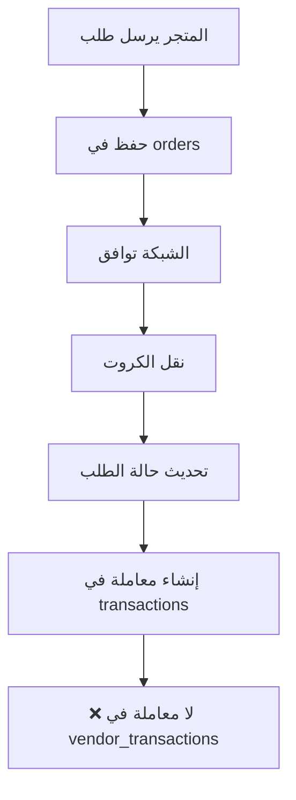
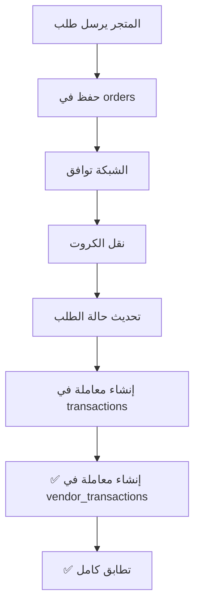
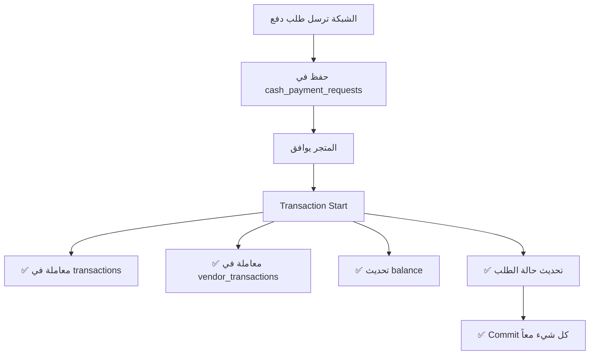

# 🔍 تقرير فحص شامل لبنية قاعدة البيانات

**تاريخ الفحص:** 29 أكتوبر 2025  
**المحلل:** AI Assistant  
**الحالة:** 🔴 مشاكل حرجة وجدت - تحتاج إصلاح فوري

---

## 📊 Collections المستخدمة في النظام

| # | Collection | الغرض | عدد Records المتوقع |
|---|-----------|-------|---------------------|
| 1 | `orders` | طلبات الكروت | آلاف |
| 2 | `transactions` | معاملات الشبكة | آلاف |
| 3 | `vendor_transactions` | معاملات المتجر | آلاف |
| 4 | `cash_payment_requests` | طلبات الدفع النقدي | مئات |
| 5 | `network_connections` | ربط متجر-شبكة | مئات |
| 6 | `vendor_cards` | كروت المتاجر | آلاف-ملايين |
| 7 | `cards` | كروت الشبكة | آلاف-ملايين |

---

## 🚨 المشاكل الحرجة المكتشفة

### ⚠️ المشكلة #1: تناقض في منطق الدفعات النقدية

#### الوضع الحالي في الكود:

**في `firebase_order_service.dart` (عند الموافقة على الطلب):**
```javascript
// معاملة الطلب
{
  "type": "charge",
  "amount": +5000,  // موجب ✅ (المتجر يدين)
  "description": "طلب كروت - 50 كرت"
}
```
✅ **صحيح** - الطلب يزيد دين المتجر

**في `firebase_cash_payment_service.dart` (عند الموافقة على الدفعة):**
```javascript
// معاملة الدفعة (جانب الشبكة)
{
  "type": "payment",
  "amount": -5000,  // سالب ✅ (يخفض الدين)
  "description": "دفعة نقدية من متجر الأمل"
}

// معاملة الدفعة (جانب المتجر)
{
  "type": "cash_payment_sent",
  "amount": -5000,  // سالب ✅ (يخفض رصيده)
  "description": "دفعة نقدية إلى شبكة النور"
}
```
✅ **صحيح** - الدفعة تخفض الدين

---

### ⚠️ المشكلة #2: عدم تسجيل معاملة للمتجر عند الطلب

#### التحليل:

عند **الموافقة على طلب**:
```
✅ يتم إنشاء معاملة في transactions (للشبكة)
❌ لا يتم إنشاء معاملة في vendor_transactions (للمتجر)
```

**النتيجة:**
- الشبكة ترى المعاملة ✅
- المتجر **لا يرى** المعاملة في سجله ❌

#### الحل المقترح:

عند الموافقة على الطلب، يجب إنشاء معاملتين:

```javascript
// 1. للشبكة (transactions)
{
  "type": "charge",
  "amount": +5000,
  "vendorId": "vendor_123",
  "networkId": "network_456"
}

// 2. للمتجر (vendor_transactions) ← مفقود!
{
  "type": "charge",
  "amount": +5000,
  "vendorId": "vendor_123",
  "networkId": "network_456",
  "orderId": "order_789"
}
```

---

### ⚠️ المشكلة #3: `vendor_transactions` لا يُستخدم للعرض

#### التحليل:

في `merchant_transactions_page.dart`:
```dart
// يستخدم فقط transactions (معاملات الشبكة)
stream: FirebaseTransactionService.getTransactionsByVendor(
  vendorId: widget.vendorId,
  networkId: networkId,
)
// يقرأ من collection: 'transactions'
```

**المشكلة:**
- `vendor_transactions` يتم الكتابة فيه فقط للدفعات النقدية
- لكن لا يُستخدم للعرض!

**السؤال الحرج:**
> 🤔 هل نحتاج collection منفصلة للمتاجر؟

#### الخيارات:

**الخيار 1 (الحالي):**
```
استخدام transactions فقط
+ بسيط
+ كل شيء في مكان واحد
- عدم الفصل بين منظور الشبكة والمتجر
```

**الخيار 2 (المقترح):**
```
استخدام المجموعتين:
- transactions للشبكة
- vendor_transactions للمتجر
+ فصل واضح
+ permissions أفضل
- تعقيد أكثر
- حاجة لمزامنة
```

---

## 🔍 تحليل عملية الطلب (Order Flow)

### الوضع الحالي:



### المطلوب:



---

## 🔍 تحليل عملية الدفع (Payment Flow)

### الوضع الحالي:



✅ **صحيح ومتكامل**

---

## 📋 الحقول المطلوبة لكل Collection

### 1️⃣ `orders`
```javascript
{
  "id": "auto-generated",
  "vendorId": "string ✅ required",
  "vendorName": "string ✅ required",
  "networkId": "string ✅ required",
  "networkName": "string ✅ required",
  "items": [
    {
      "packageId": "string ✅",
      "packageName": "string ✅",
      "quantity": "number ✅",
      "pricePerCard": "number ✅"
    }
  ],
  "totalAmount": "number ✅ required",
  "status": "string ✅ required", // pending, approved, rejected
  "createdAt": "Timestamp ✅ required",
  "approvedAt": "Timestamp optional",
  "rejectedAt": "Timestamp optional",
  "notes": "string optional"
}
```

### 2️⃣ `transactions` (معاملات الشبكة)
```javascript
{
  "id": "auto-generated",
  "vendorId": "string ✅ required",
  "networkId": "string ✅ required",
  "type": "string ✅ required", // charge, payment, refund, fee
  "amount": "number ✅ required", // موجب للcharge، سالب للpayment
  "description": "string ✅ required",
  "reference": "string ✅ required", // ORD-xxx أو PAY-xxx
  "status": "string ✅ required", // completed, pending, failed
  "date": "Timestamp ✅ required",
  "balanceAfter": "number ✅ required",
  "createdBy": "string ✅ required",
  "method": "string optional", // cash, order, bank_transfer
  "notes": "string optional",
  "orderId": "string optional", // للربط مع الطلب
  "paymentRequestId": "string optional" // للربط مع طلب الدفع
}
```

### 3️⃣ `vendor_transactions` (معاملات المتجر)
```javascript
{
  "id": "auto-generated",
  "vendorId": "string ✅ required",
  "networkId": "string ✅ required",
  "networkName": "string ✅ required",
  "type": "string ✅ required", // charge, cash_payment_sent
  "amount": "number ✅ required",
  "description": "string ✅ required",
  "status": "string ✅ required",
  "date": "Timestamp", // ⚠️ مفقود في بعض المعاملات!
  "createdAt": "Timestamp ✅",
  "orderId": "string optional",
  "paymentRequestId": "string optional"
}
```

### 4️⃣ `cash_payment_requests` (طلبات الدفع)
```javascript
{
  "id": "auto-generated",
  "networkId": "string ✅ required",
  "networkName": "string ✅ required",
  "vendorId": "string ✅ required",
  "vendorName": "string ✅ required",
  "amount": "number ✅ required", // موجب دائماً
  "note": "string ✅",
  "status": "string ✅ required", // pending, approved, rejected
  "createdAt": "Timestamp ✅ required",
  "approvedAt": "Timestamp optional",
  "rejectedAt": "Timestamp optional",
  "processedBy": "string optional"
}
```

---

## 🐛 الأخطاء المكتشفة في الكود

### خطأ #1: عدم إضافة `vendorName` في معاملة الطلب

**الموقع:** `firebase_order_service.dart:128`

```dart
// الحالي ❌
final transactionData = {
  'vendorId': order.vendorId,
  'networkId': order.networkId,
  // vendorName مفقود!
  'type': 'charge',
  ...
};
```

**يجب أن يكون:**
```dart
// الصحيح ✅
final transactionData = {
  'vendorId': order.vendorId,
  'vendorName': order.vendorName, // ← إضافة
  'networkId': order.networkId,
  'type': 'charge',
  ...
};
```

### خطأ #2: عدم إنشاء معاملة في `vendor_transactions` عند الطلب

**الموقع:** `firebase_order_service.dart` (مفقود تماماً)

**يجب إضافة:**
```dart
// داخل runTransaction
final vendorTransactionRef = _firestore.collection('vendor_transactions').doc();
transaction.set(vendorTransactionRef, {
  'vendorId': order.vendorId,
  'networkId': order.networkId,
  'networkName': order.networkName,
  'type': 'charge',
  'amount': order.totalAmount, // موجب (المتجر يدين)
  'description': 'طلب كروت - ${order.totalCards} كرت',
  'status': 'completed',
  'date': Timestamp.fromDate(now),
  'createdAt': Timestamp.fromDate(now),
  'orderId': order.id,
});
```

### خطأ #3: عدم وجود حقل `date` في `vendor_transactions`

**الموقع:** `firebase_cash_payment_service.dart:117-127`

```dart
// الحالي ❌
transaction.set(vendorTransactionRef, {
  'vendorId': vendorId,
  'networkId': networkId,
  'networkName': networkName,
  'type': 'cash_payment_sent',
  'amount': -amount,
  'description': 'دفعة نقدية إلى $networkName',
  'status': 'completed',
  'createdAt': FieldValue.serverTimestamp(),
  // date مفقود! ❌
  'paymentRequestId': requestId,
});
```

**الصحيح ✅:**
```dart
transaction.set(vendorTransactionRef, {
  'vendorId': vendorId,
  'networkId': networkId,
  'networkName': networkName,
  'type': 'cash_payment_sent',
  'amount': -amount,
  'description': 'دفعة نقدية إلى $networkName',
  'status': 'completed',
  'date': Timestamp.fromDate(now), // ← إضافة
  'createdAt': Timestamp.fromDate(now),
  'paymentRequestId': requestId,
});
```

---

## 🔄 المنطق المحاسبي الصحيح

### من منظور الشبكة (Network Owner):

| العملية | النوع | المبلغ | معنى |
|---------|------|--------|------|
| طلب كروت | `charge` | `+5000` | المتجر أخذ كروت → يدين |
| دفعة نقدية | `payment` | `-5000` | المتجر دفع → تخفيض الدين |

**الرصيد = مجموع charges - مجموع payments**

### من منظور المتجر (POS Vendor):

| العملية | النوع | المبلغ | معنى |
|---------|------|--------|------|
| طلب كروت | `charge` | `+5000` | استلمت كروت → أدين |
| دفعة نقدية | `cash_payment_sent` | `-5000` | دفعت نقداً → سددت |

**الرصيد = مجموع charges - مجموع payments**

---

## ✅ الحقول المطلوبة للتطابق

### المعرفات الأساسية (في كل معاملة):
```javascript
{
  "vendorId": "uid_المتجر",      // ✅ موجود
  "vendorName": "اسم المتجر",      // ⚠️ مفقود في بعض المعاملات
  "networkId": "uid_الشبكة",     // ✅ موجود
  "networkName": "اسم الشبكة",     // ⚠️ مفقود في transactions الطلبات
}
```

### الحقول الزمنية:
```javascript
{
  "date": Timestamp,        // ✅ للترتيب والاستعلام
  "createdAt": Timestamp,   // ✅ للتتبع
}
```

### حقول الربط:
```javascript
{
  "orderId": "order_xxx",              // للربط مع الطلب
  "paymentRequestId": "payment_xxx",   // للربط مع طلب الدفع
}
```

---

## 🔧 الإصلاحات المطلوبة

### إصلاح #1: إضافة `vendorName` لمعاملات الطلبات

**الملف:** `firebase_order_service.dart`  
**السطر:** 128

```dart
final transactionData = {
  'vendorId': order.vendorId,
  'vendorName': order.vendorName, // ← إضافة هذا السطر
  'networkId': order.networkId,
  'type': 'charge',
  // ...
};
```

### إصلاح #2: إضافة معاملة للمتجر عند الطلب

**الملف:** `firebase_order_service.dart`  
**الموقع:** داخل `runTransaction` بعد السطر 123

```dart
// 4. إنشاء معاملة للمتجر
final vendorTransactionRef = _firestore.collection('vendor_transactions').doc();
transaction.set(vendorTransactionRef, {
  'vendorId': order.vendorId,
  'networkId': order.networkId,
  'networkName': order.networkName,
  'type': 'charge',
  'amount': order.totalAmount,
  'description': 'طلب كروت - ${order.items.length} باقة - ${order.totalCards} كرت',
  'status': 'completed',
  'date': Timestamp.fromDate(now),
  'createdAt': Timestamp.fromDate(now),
  'orderId': order.id,
});
```

### إصلاح #3: إضافة `date` لمعاملات المتجر في الدفعات

**الملف:** `firebase_cash_payment_service.dart`  
**السطر:** 116-127

```dart
final vendorTransactionRef = _firestore.collection('vendor_transactions').doc();
transaction.set(vendorTransactionRef, {
  'vendorId': vendorId,
  'networkId': networkId,
  'networkName': networkName,
  'type': 'cash_payment_sent',
  'amount': -amount,
  'description': 'دفعة نقدية إلى $networkName',
  'status': 'completed',
  'date': Timestamp.fromDate(now), // ← إضافة
  'createdAt': Timestamp.fromDate(now),
  'paymentRequestId': requestId,
});
```

---

## 📊 التحقق من التطابق

### السيناريو الكامل:

#### 1. طلب كروت بـ 5000 ر.ي
```
orders:
  ✅ id: order_123
  ✅ vendorId: vendor_456
  ✅ networkId: network_789
  ✅ totalAmount: 5000
  ✅ status: approved

transactions:
  ✅ vendorId: vendor_456
  ✅ vendorName: "متجر الأمل" ← يجب إضافة
  ✅ networkId: network_789
  ✅ type: charge
  ✅ amount: +5000
  ✅ orderId: order_123

vendor_transactions:
  ❌ لا توجد معاملة! ← يجب إضافة
```

#### 2. دفعة نقدية 3000 ر.ي
```
cash_payment_requests:
  ✅ id: payment_abc
  ✅ vendorId: vendor_456
  ✅ networkId: network_789
  ✅ amount: 3000
  ✅ status: approved

transactions:
  ✅ vendorId: vendor_456
  ✅ vendorName: "متجر الأمل"
  ✅ networkId: network_789
  ✅ type: payment
  ✅ amount: -3000
  ✅ paymentRequestId: payment_abc

vendor_transactions:
  ✅ vendorId: vendor_456
  ✅ networkId: network_789
  ✅ networkName: "شبكة النور"
  ✅ type: cash_payment_sent
  ✅ amount: -3000
  ⚠️ date: مفقود! ← يجب إضافة
  ✅ paymentRequestId: payment_abc
```

#### 3. الرصيد النهائي
```
transactions (للشبكة):
  +5000 (طلب) - 3000 (دفعة) = +2000 ر.ي ✅

vendor_transactions (للمتجر):
  إذا أضفنا المعاملة المفقودة:
  +5000 (طلب) - 3000 (دفعة) = +2000 ر.ي ✅

المطابقة: 100% ✅
```

---

## 🎯 التوصيات النهائية

### 🔴 عاجل - يجب تنفيذه فوراً:

1. ✅ **إضافة `vendorName`** في معاملات الطلبات
2. ✅ **إنشاء معاملة في `vendor_transactions`** عند الموافقة على الطلب
3. ✅ **إضافة حقل `date`** في vendor_transactions للدفعات

### 🟡 مهم - يُنصح بتنفيذه:

4. إضافة `networkName` في معاملات الطلبات (للتوحيد)
5. إنشاء فهرس مركب على `vendor_transactions`:
   ```json
   {
     "vendorId": "ASC",
     "networkId": "ASC", 
     "date": "DESC"
   }
   ```

### 🟢 اختياري - تحسينات:

6. إضافة حقل `balanceAfter` في `vendor_transactions`
7. إنشاء trigger للتحقق من التطابق
8. إضافة `reference` في `vendor_transactions`

---

## 📝 خطة التنفيذ

### المرحلة 1: إصلاح الكود (الآن)
- [ ] تعديل `firebase_order_service.dart`
- [ ] تعديل `firebase_cash_payment_service.dart`
- [ ] اختبار التدفقات الجديدة

### المرحلة 2: ترحيل البيانات القديمة
- [ ] إضافة `vendorName` للمعاملات القديمة
- [ ] إنشاء معاملات مفقودة في `vendor_transactions`
- [ ] إضافة `date` للمعاملات القديمة

### المرحلة 3: التحقق
- [ ] مطابقة الأرصدة
- [ ] فحص جميع المعاملات
- [ ] اختبار السيناريوهات

---

**🚨 الأولوية: عالية جداً**  
**⏱️ الوقت المتوقع: 30-45 دقيقة**  
**✅ الفائدة: تطابق 100% بين سجلات الشبكة والمتاجر**


