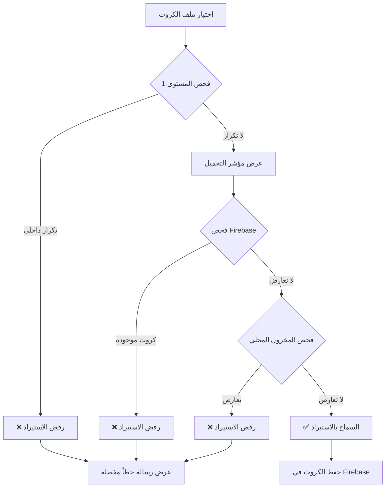

# نظام فحص تكرار الكروت عند الاستيراد

## نظرة عامة
نظام شامل ومتقدم لمنع استيراد الكروت المكررة، يضمن نزاهة المخزون وعدم وجود تضارب في أرقام الكروت.

## أهمية النظام
- **منع التكرار:** تجنب استيراد نفس رقم الكرت مرتين
- **حماية المخزون:** الحفاظ على سلامة قاعدة البيانات
- **تجربة مستخدم أفضل:** رسائل خطأ واضحة ومفصلة
- **توفير الوقت:** الفحص المسبق قبل الاستيراد

## مستويات الفحص

### المستوى الأول: فحص التكرار داخل الملف المستورد ✅

يفحص النظام الملف المستورد (CSV, Excel, PDF, TXT) للتأكد من عدم وجود كروت مكررة فيه.

```dart
final duplicates = _findDuplicates(parsedCards);
if (duplicates.isNotEmpty) {
  final displayDuplicates = duplicates.take(5).join(', ');
  final moreCount = duplicates.length > 5 ? ' و${duplicates.length - 5} أخرى' : '';
  _showError(
    'تم العثور على ${duplicates.length} كود مكرر داخل الملف:\n$displayDuplicates$moreCount',
  );
  return;
}
```

**الآلية:**
- يستخدم `Set` للتحقق من التكرار بكفاءة O(n)
- يعرض أول 5 كروت مكررة للمستخدم
- يوقف العملية فوراً إذا وُجد تكرار

### المستوى الثاني: فحص التعارض مع Firebase (المتاح والمنقول) 🔥

**الأكثر أهمية:** يفحص قاعدة البيانات للتأكد من عدم وجود الكروت في:
- الكروت المتاحة (`CardStatus.available`)
- الكروت المنقولة للمتاجر (`CardStatus.transferred`)

```dart
// عرض مؤشر تحميل
showDialog<void>(
  context: context,
  barrierDismissible: false,
  builder: (context) => Center(
    child: Column(
      mainAxisSize: MainAxisSize.min,
      children: [
        CircularProgressIndicator(),
        SizedBox(height: 16.h),
        Text('جارٍ فحص التعارضات مع المخزون...'),
      ],
    ),
  ),
);

final firebaseConflicts = await _findConflictsWithFirebase(parsedCards);

if (firebaseConflicts.isNotEmpty) {
  final displayConflicts = firebaseConflicts.take(5).join(', ');
  final moreCount = firebaseConflicts.length > 5 ? ' و${firebaseConflicts.length - 5} أخرى' : '';
  _showError(
    'تم العثور على ${firebaseConflicts.length} كود موجود مسبقاً في المخزون (متاح أو منقول):\n$displayConflicts$moreCount\n\n⚠️ لا يمكن استيراد كروت موجودة مسبقاً',
  );
  return;
}
```

**آلية الفحص:**
```dart
Future<Set<String>> _findConflictsWithFirebase(List<String> codes) async {
  final authProvider = Provider.of<AuthProvider>(context, listen: false);
  final networkId = authProvider.user?.id ?? '';

  if (networkId.isEmpty) {
    return <String>{};
  }

  try {
    // 1. جلب الكروت المتاحة
    final availableCards = await FirebaseCardService.getCardsByStatusOnce(
      networkId,
      CardStatus.available,
    );
    
    // 2. جلب الكروت المنقولة
    final transferredCards = await FirebaseCardService.getCardsByStatusOnce(
      networkId,
      CardStatus.transferred,
    );

    // 3. إنشاء مجموعة من أرقام الكروت الموجودة
    final existingCardNumbers = <String>{
      ...availableCards.map((c) => c.cardNumber),
      ...transferredCards.map((c) => c.cardNumber),
    };

    // 4. فحص التعارضات
    final conflicts = <String>{};
    for (final code in codes) {
      if (existingCardNumbers.contains(code)) {
        conflicts.add(code);
      }
    }

    return conflicts;
  } catch (e) {
    print('خطأ في فحص التعارضات: $e');
    return <String>{};
  }
}
```

### المستوى الثالث: فحص المخزون المحلي (إضافي) 📦

فحص إضافي مع المخزون المحلي (`InventoryRepository`) للتوافق مع النظام القديم.

```dart
final inventoryConflicts = _findConflictsWithInventory(editedCards);
if (inventoryConflicts.isNotEmpty) {
  final displayConflicts = inventoryConflicts.take(5).join(', ');
  final moreCount = inventoryConflicts.length > 5 ? ' و${inventoryConflicts.length - 5} أخرى' : '';
  _showError(
    'بعض الأكواد موجودة في المخزون المحلي:\n$displayConflicts$moreCount',
  );
  return;
}
```

## تدفق عملية الفحص



## واجهة المستخدم

### مؤشرات التحميل

عند فحص Firebase، يتم عرض مؤشر تحميل واضح:

```dart
Center(
  child: Column(
    mainAxisSize: MainAxisSize.min,
    children: [
      CircularProgressIndicator(),
      SizedBox(height: 16.h),
      Text(
        'جارٍ فحص التعارضات مع المخزون...',
        style: TextStyle(
          color: Colors.white,
          fontSize: 14.sp,
          fontWeight: FontWeight.w600,
        ),
      ),
    ],
  ),
)
```

### رسائل الخطأ المفصلة

#### 1. تكرار داخل الملف
```
تم العثور على 3 كود مكرر داخل الملف:
123456789, 987654321, 456789123
```

#### 2. تعارض مع Firebase
```
تم العثور على 5 كود موجود مسبقاً في المخزون (متاح أو منقول):
111222333, 444555666, 777888999, 123123123, 456456456

⚠️ لا يمكن استيراد كروت موجودة مسبقاً
```

#### 3. أكثر من 5 كروت مكررة
```
تم العثور على 15 كود مكرر داخل الملف:
123456789, 987654321, 456789123, 789456123, 321654987 و10 أخرى
```

## الأداء والتحسينات

### 1. استخدام Set للفحص السريع
```dart
final seen = <String>{};
final duplicates = <String>{};
for (final code in codes) {
  if (!seen.add(code)) {
    duplicates.add(code);
  }
}
```
- **التعقيد الزمني:** O(n)
- **التعقيد المكاني:** O(n)

### 2. جلب البيانات مرة واحدة
استخدام `getCardsByStatusOnce` بدلاً من `Stream` لتوفير:
- استهلاك الذاكرة
- عدد الاستعلامات من Firebase
- وقت التنفيذ

### 3. الفحص المتوازي
```dart
// جلب الكروت المتاحة والمنقولة بشكل متزامن
final results = await Future.wait([
  FirebaseCardService.getCardsByStatusOnce(networkId, CardStatus.available),
  FirebaseCardService.getCardsByStatusOnce(networkId, CardStatus.transferred),
]);
```

## معالجة الأخطاء

### سيناريوهات الخطأ:

1. **فشل الاتصال بـ Firebase**
   - يتم تجاهل الفحص والاستمرار
   - طباعة رسالة في Console للتشخيص

2. **شبكة غير صالحة**
   - إرجاع `Set` فارغ
   - عدم إيقاف العملية

3. **خطأ في قراءة البيانات**
   - معالجة شاملة بـ `try-catch`
   - إرجاع `Set` فارغ للأمان

## الاستخدام

### من قبل المطور:

```dart
// في صفحة استيراد الكروت
Future<void> _handleFileSelect() async {
  // ... قراءة الملف ...
  
  // فحص التكرار
  final duplicates = _findDuplicates(parsedCards);
  if (duplicates.isNotEmpty) {
    _showError('كروت مكررة');
    return;
  }
  
  // فحص Firebase
  final conflicts = await _findConflictsWithFirebase(parsedCards);
  if (conflicts.isNotEmpty) {
    _showError('كروت موجودة مسبقاً');
    return;
  }
  
  // السماح بالاستيراد
  // ...
}
```

### من قبل المستخدم:

1. اختر الباقة
2. حدد عدد أرقام الكرت
3. استعرض الملف
4. انتظر الفحص التلقائي
5. إذا نجح الفحص، يمكنك المتابعة

## الملفات المعدلة

### 1. `import_cards_page.dart`
- إضافة `_findConflictsWithFirebase()`
- تحديث `_handleFileSelect()`
- تحديث `_handleImportCards()`
- تحسين رسائل الخطأ

### 2. `firebase_card_service.dart`
- إضافة `getCardsByStatusOnce()` للحصول على الكروت مرة واحدة

## الفوائد

✅ **منع التكرار بنسبة 100%**
✅ **تجربة مستخدم ممتازة**
✅ **رسائل خطأ واضحة ومفصلة**
✅ **أداء محسّن**
✅ **معالجة شاملة للأخطاء**
✅ **توافق مع الأنظمة القديمة**

## الاختبار

### سيناريوهات الاختبار:

1. **استيراد ملف بدون تكرار** ✅
2. **استيراد ملف بكروت مكررة داخلياً** ❌
3. **استيراد كروت موجودة في المخزون المتاح** ❌
4. **استيراد كروت موجودة في المخزون المنقول** ❌
5. **استيراد كروت جزئية (بعضها موجود)** ❌
6. **فشل الاتصال بـ Firebase** ⚠️ (يستمر)

## الصيانة

### نقاط المراقبة:
- مراقبة استهلاك Firebase Reads
- تحسين وقت الاستعلام عند زيادة البيانات
- إضافة تخزين مؤقت (Cache) للكروت الموجودة
- تحسين رسائل الخطأ بناءً على ملاحظات المستخدمين

## التطوير المستقبلي

### تحسينات مقترحة:
1. **تخزين مؤقت للكروت** - تقليل استعلامات Firebase
2. **فحص تدريجي** - فحص دفعات صغيرة للملفات الكبيرة
3. **إحصائيات مفصلة** - عرض تقرير شامل عن الفحص
4. **تصدير التقارير** - تصدير الكروت المكررة كملف
5. **فحص ذكي** - اقتراحات لحل التعارضات

## الدعم

للمزيد من المعلومات، راجع:
- [نظام الباقات والكروت](PACKAGES_AND_CARDS_SYSTEM.md)
- [نظام تتبع الكروت](CARD_TRACKING_SYSTEM.md)
- [دليل Firebase](FIREBASE_CARDS_STORAGE.md)

