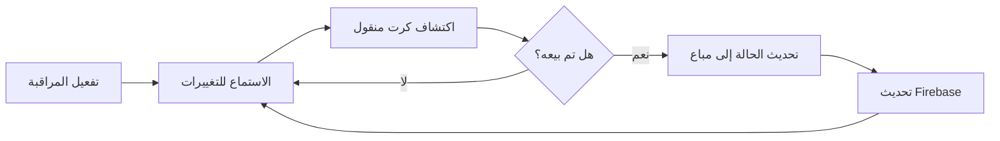
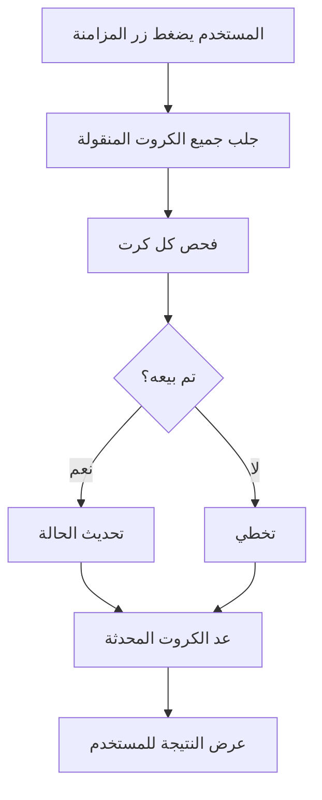

# نظام تتبع الكروت المباعة

## نظرة عامة
نظام متقدم لتتبع الكروت التي يتم بيعها من قبل أصحاب المتاجر (POS Vendors) ونقلها تلقائياً من حالة "منقولة للمتاجر" إلى حالة "مباعة".

## المكونات الرئيسية

### 1. خدمة التتبع (`FirebaseCardTrackingService`)

**الموقع:** `lib/features/network_owner/data/services/firebase_card_tracking_service.dart`

#### الوظائف الأساسية:

##### `watchSoldCards(String networkId)`
- **الوصف:** مراقبة الكروت المباعة في الوقت الفعلي
- **الآلية:** يستمع للتغييرات على كروت المتاجر ويحدث حالتها تلقائياً
- **الإرجاع:** `Stream<List<CardModel>>`

```dart
// مثال الاستخدام
final service = FirebaseCardTrackingService();
service.watchSoldCards(networkId).listen((soldCards) {
  print('تم اكتشاف ${soldCards.length} كرت مباع جديد');
});
```

##### `_checkIfCardSoldByVendor(CardModel card)`
- **الوصف:** التحقق من بيع الكرت من قبل المتجر
- **الآلية:** 
  1. البحث في معاملات المتاجر (`vendor_transactions`)
  2. البحث في سجلات المبيعات (`sales`)
- **الإرجاع:** `Future<bool>`

##### `syncAllSoldCards(String networkId)`
- **الوصف:** مزامنة جميع الكروت المباعة (استخدام لمرة واحدة)
- **الاستخدام:** للمزامنة اليدوية أو المزامنة الأولية
- **الإرجاع:** عدد الكروت التي تم تحديثها

```dart
final updatedCount = await service.syncAllSoldCards(networkId);
print('تم مزامنة $updatedCount كرت');
```

##### `startAutomaticTracking(String networkId)`
- **الوصف:** تشغيل المراقبة التلقائية للكروت المباعة
- **الآلية:** يعمل في الخلفية ويراقب التغييرات باستمرار

### 2. صفحة المخزون (`NetworkStoredPage`)

#### التحديثات الجديدة:

##### 1. عرض الجدول بعرض الشاشة الكامل
```dart
child: SizedBox(
  width: MediaQuery.of(context).size.width,
  child: DataTable(...)
)
```

##### 2. إحصائيات ديناميكية حسب التبويب
- **الكروت المتاحة:** يعرض إجمالي الكروت المتاحة
- **المنقولة للمتاجر:** يعرض إجمالي الكروت المنقولة
- **المباعة:** يعرض إجمالي الكروت المباعة

```dart
String totalLabel;
Color totalColor;
switch (_selectedView) {
  case 'available':
    totalLabel = 'الكروت المتاحة';
    totalColor = AppColors.primary;
    break;
  case 'transferred':
    totalLabel = 'المنقولة للمتاجر';
    totalColor = AppColors.blue500;
    break;
  case 'sold':
    totalLabel = 'الكروت المباعة';
    totalColor = AppColors.success;
    break;
}
```

##### 3. زر المزامنة اليدوية
- **الموقع:** شريط الأدوات (AppBar)
- **الظهور:** فقط عند عرض تبويب "المنقولة للمتاجر"
- **الوظيفة:** مزامنة الكروت المباعة يدوياً
- **المؤشر:** يعرض CircularProgressIndicator أثناء المزامنة

```dart
if (_selectedView == 'transferred')
  IconButton(
    icon: _isSyncing
        ? CircularProgressIndicator(...)
        : Icon(Icons.sync),
    onPressed: _isSyncing ? null : _syncSoldCards,
    tooltip: 'مزامنة الكروت المباعة',
  ),
```

## آلية العمل

### 1. المراقبة التلقائية



### 2. المزامنة اليدوية



## التكامل مع المتاجر

### مصادر البيانات المستخدمة:

1. **معاملات المتاجر** (`vendor_transactions`)
   ```javascript
   {
     cardNumber: "1234567890",
     type: "sale",
     timestamp: "2025-01-15T10:30:00Z",
     vendorId: "vendor_123"
   }
   ```

2. **سجلات المبيعات** (`sales`)
   ```javascript
   {
     cardNumber: "1234567890",
     status: "completed",
     saleDate: "2025-01-15T10:30:00Z",
     amount: 50.00
   }
   ```

## الإشعارات

### 1. إشعارات النجاح
```dart
CustomToast.success(
  context,
  'تم تحديث $updatedCount كرت إلى حالة (مباع)',
  title: 'تمت المزامنة بنجاح',
);
```

### 2. إشعارات المعلومات
```dart
CustomToast.info(
  context,
  'جميع الكروت محدثة، لا توجد كروت جديدة للمزامنة',
  title: 'لا توجد تحديثات',
);
```

### 3. إشعارات الأخطاء
```dart
CustomToast.error(
  context,
  ErrorHandler.extractErrorMessage(e.toString()),
  title: 'فشلت المزامنة',
);
```

## الأداء والتحسينات

### 1. المراقبة الذكية
- استخدام `Stream` للمراقبة في الوقت الفعلي
- تجنب التحديثات المتكررة باستخدام `asyncMap`

### 2. معالجة الأخطاء
- معالجة شاملة للأخطاء في جميع العمليات
- رسائل خطأ واضحة ومفصلة
- عدم تعطل التطبيق في حالة الأخطاء

### 3. واجهة المستخدم
- مؤشرات تحميل واضحة
- إشعارات فورية عن نتائج العمليات
- تصميم responsive يتكيف مع حجم الشاشة

## الاستخدام

### 1. التفعيل التلقائي
يتم تفعيل المراقبة التلقائية عند فتح صفحة المخزون:

```dart
@override
void initState() {
  super.initState();
  _loadCards();
  
  FirebaseCardCleanupService.scheduleAutomaticCleanup();
  
  // تفعيل المراقبة التلقائية للكروت المباعة
  final authProvider = Provider.of<AuthProvider>(context, listen: false);
  final networkId = authProvider.user?.id ?? '';
  if (networkId.isNotEmpty) {
    FirebaseCardTrackingService.startAutomaticTracking(networkId);
  }
}
```

### 2. المزامنة اليدوية
للمزامنة اليدوية:
1. افتح صفحة المخزون
2. انتقل إلى تبويب "المنقولة للمتاجر"
3. اضغط على أيقونة المزامنة (🔄) في شريط الأدوات

## الصيانة والتطوير المستقبلي

### التحسينات المقترحة:
1. إضافة فلاتر بحث متقدمة
2. تصدير التقارير الإحصائية
3. إشعارات push عند بيع كروت
4. لوحة تحكم للإحصائيات المباشرة
5. تكامل مع أنظمة الدفع الإلكتروني

### ملاحظات مهمة:
- التأكد من صلاحيات Firebase الصحيحة
- مراجعة القواعد الأمنية (Security Rules)
- مراقبة استهلاك Firestore Reads
- اختبار الأداء مع أعداد كبيرة من الكروت

## الدعم والمساعدة
للمزيد من المعلومات، راجع:
- [نظام الباقات والكروت](PACKAGES_AND_CARDS_SYSTEM.md)
- [نظام المعاملات](TRANSACTIONS_SYSTEM.md)
- [دليل Firebase](FIREBASE_CARDS_STORAGE.md)

