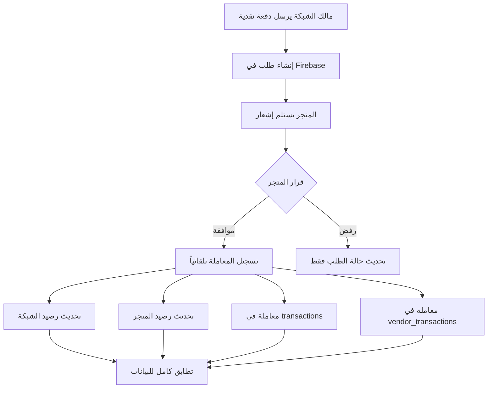

# نظام الدفعات النقدية المتكامل

## نظرة عامة
نظام شامل لإدارة الدفعات النقدية بين مالك الشبكة والمتاجر، مع تسجيل تلقائي للمعاملات وتحديث الأرصدة وإشعارات فورية.

## تدفق العمل الكامل



## المكونات الرئيسية

### 1. النموذج (`CashPaymentRequestModel`)

**الحقول:**
```dart
class CashPaymentRequestModel {
  final String id;
  final String networkId;
  final String networkName;
  final String vendorId;
  final String vendorName;
  final double amount;
  final String note;
  final String status; // pending, approved, rejected
  final DateTime createdAt;
  final DateTime? approvedAt;
  final DateTime? rejectedAt;
  final String? processedBy;
}
```

**الحالات الممكنة:**
- `pending`: بانتظار قرار المتجر
- `approved`: تمت الموافقة
- `rejected`: تم الرفض

### 2. الخدمة (`FirebaseCashPaymentService`)

#### الوظائف الأساسية:

##### `createPaymentRequest()`
إنشاء طلب دفعة جديد من مالك الشبكة.

```dart
static Future<String> createPaymentRequest(
  CashPaymentRequestModel request
) async {
  final docRef = await _firestore
      .collection('cash_payment_requests')
      .add(request.toJson());
  return docRef.id;
}
```

##### `approvePaymentRequest()` 🔥
**الوظيفة الأهم:** الموافقة على الدفعة مع تسجيل تلقائي شامل.

```dart
static Future<void> approvePaymentRequest(
  String requestId,
  String vendorId,
) async {
  await _firestore.runTransaction((transaction) async {
    // 1. تحديث حالة الطلب
    transaction.update(requestDoc, {
      'status': 'approved',
      'approvedAt': FieldValue.serverTimestamp(),
      'processedBy': vendorId,
    });

    // 2. معاملة الشبكة (إيجابية)
    transaction.set(networkTransactionRef, {
      'type': 'cash_payment_received',
      'amount': amount, // موجب
      // ...
    });

    // 3. معاملة المتجر (سلبية)
    transaction.set(vendorTransactionRef, {
      'type': 'cash_payment_sent',
      'amount': -amount, // سالب
      // ...
    });

    // 4. تحديث رصيد المتجر
    final newBalance = currentBalance + amount;
    transaction.update(connectionDoc, {
      'balance': newBalance,
    });
  });
}
```

**المميزات:**
- ✅ **Transaction واحدة** - إما تنجح كلها أو تفشل كلها
- ✅ **4 عمليات متزامنة** في خطوة واحدة
- ✅ **تطابق تلقائي** بين جميع السجلات
- ✅ **معالجة آمنة** للأخطاء

##### `rejectPaymentRequest()`
رفض طلب الدفعة (لا يسجل معاملات).

##### `getVendorPaymentRequests()`
Stream للحصول على طلبات دفع المتجر (تحديث فوري).

##### `getPendingPaymentsCount()`
Stream لعد الطلبات المعلقة (للإشعارات).

### 3. واجهة مالك الشبكة

#### صفحة إرسال الدفعة (`NetworkCashPaymentPage`)

**الخطوات:**
1. اختيار المتجر من القائمة
2. إدخال المبلغ
3. إضافة ملاحظة (اختياري)
4. إرسال الطلب

**الكود:**
```dart
final paymentRequest = CashPaymentRequestModel(
  id: '',
  networkId: networkId,
  networkName: networkName,
  vendorId: selectedVendor.id,
  vendorName: selectedVendor.name,
  amount: parsedAmount,
  note: noteController.text.trim(),
  status: 'pending',
  createdAt: DateTime.now(),
);

await FirebaseCashPaymentService.createPaymentRequest(paymentRequest);
```

**الإشعار:**
```
✅ تم إرسال دفعة 5,000 ر.ي
   تم إرسال الطلب إلى متجر الأمل
```

### 4. واجهة المتجر

#### صفحة الدفعات (`PosVendorCashPaymentsPage`)

**المميزات:**
- 📡 **Stream مباشر** من Firebase
- 🔄 **Pull-to-refresh**
- 💀 **Skeleton loading**
- 🎨 **بطاقات ملونة** حسب الحالة

**بطاقة الطلب:**
```
┌─────────────────────────────────────┐
│ 💰 [أيقونة]  شبكة العاصمة          │
│    5,000 ر.ي        ⏳ بانتظار...  │
├─────────────────────────────────────┤
│ 📝 دفعة نقدية مقابل المبيعات       │
│ 🕐 28/10/2025 - 14:30             │
├─────────────────────────────────────┤
│     [رفض ❌]        [موافقة ✅]     │
└─────────────────────────────────────┘
```

#### حوار الموافقة:
```
╔═══════════════════════════════════╗
║ تأكيد الموافقة                   ║
╠═══════════════════════════════════╣
║ هل تؤكد استلام مبلغ 5,000 ر.ي   ║
║ نقداً من شبكة العاصمة؟           ║
║                                   ║
║ سيتم تسجيل المعاملة تلقائياً.    ║
╠═══════════════════════════════════╣
║        [إلغاء]    [تأكيد]        ║
╚═══════════════════════════════════╝
```

### 5. نظام الإشعارات

#### عداد في AppBar:
```dart
StreamBuilder<int>(
  stream: FirebaseCashPaymentService.getPendingPaymentsCount(vendorId),
  builder: (context, snapshot) {
    final pendingCount = snapshot.data ?? 0;
    return Stack(
      children: [
        Icon(Icons.notifications_none),
        if (pendingCount > 0)
          Positioned(
            child: Container(
              // دائرة حمراء مع العدد
              child: Text('$pendingCount'),
            ),
          ),
      ],
    );
  },
)
```

#### شارة في زر الدفعات:
```dart
_QuickActionTileWithBadge(
  icon: Icons.payments_outlined,
  label: 'دفعات نقدية',
  badgeCount: pendingCount, // 🔴
  onTap: () => ...,
)
```

## التسجيل التلقائي للمعاملات

### عند الموافقة على الدفعة:

#### 1. معاملة الشبكة (`transactions`)
```javascript
{
  networkId: "network_123",
  vendorId: "vendor_456",
  vendorName: "متجر الأمل",
  type: "cash_payment_received",
  amount: 5000, // موجب ✅
  description: "دفعة نقدية من متجر الأمل",
  status: "completed",
  createdAt: "2025-10-28T14:30:00Z",
  paymentRequestId: "req_789"
}
```

#### 2. معاملة المتجر (`vendor_transactions`)
```javascript
{
  vendorId: "vendor_456",
  networkId: "network_123",
  networkName: "شبكة العاصمة",
  type: "cash_payment_sent",
  amount: -5000, // سالب ✅
  description: "دفعة نقدية إلى شبكة العاصمة",
  status: "completed",
  createdAt: "2025-10-28T14:30:00Z",
  paymentRequestId: "req_789"
}
```

#### 3. تحديث الرصيد (`network_connections`)
```javascript
{
  vendorId: "vendor_456",
  networkId: "network_123",
  balance: 10000 + 5000 = 15000, // تحديث تلقائي ✅
  updatedAt: "2025-10-28T14:30:00Z"
}
```

### التطابق التام:

| الحساب | المعاملة | المبلغ | الرصيد |
|--------|----------|--------|--------|
| **الشبكة** | `+5000` | موجب | يزيد |
| **المتجر** | `-5000` | سالب | ينقص |
| **المجموع** | `0` | متوازن ✅ | - |

## الأمان والموثوقية

### 1. استخدام Transactions
```dart
await _firestore.runTransaction((transaction) async {
  // جميع العمليات معاً
  // إذا فشلت واحدة، تفشل الكل
});
```

**الفوائد:**
- ✅ **Atomicity:** إما تنجح كلها أو تفشل كلها
- ✅ **Consistency:** تطابق تام بين جميع السجلات
- ✅ **Isolation:** لا تتداخل العمليات المتزامنة
- ✅ **Durability:** البيانات محفوظة بشكل دائم

### 2. معالجة الأخطاء
```dart
try {
  await FirebaseCashPaymentService.approvePaymentRequest(...);
  CustomToast.success(context, 'تمت الموافقة');
} catch (e) {
  CustomToast.error(
    context,
    ErrorHandler.extractErrorMessage(e.toString()),
  );
}
```

### 3. التحقق من البيانات
- ✅ فحص وجود الطلب
- ✅ فحص صلاحيات المستخدم
- ✅ التحقق من صحة المبالغ
- ✅ معالجة الحالات الاستثنائية

## الاستخدام

### من جانب مالك الشبكة:

#### 1. إرسال دفعة:
```dart
// في NetworkCashPaymentPage
1. اختر المتجر
2. أدخل المبلغ (مثال: 5000)
3. اكتب ملاحظة (اختياري)
4. اضغط "إرسال"
```

#### 2. النتيجة:
- ✅ يتم إنشاء طلب في Firebase
- 📧 المتجر يستلم إشعار
- ⏳ في انتظار قرار المتجر

### من جانب المتجر:

#### 1. استلام الإشعار:
- 🔔 رقم على أيقونة الإشعارات (AppBar)
- 🔴 شارة على زر "دفعات نقدية"

#### 2. فتح صفحة الدفعات:
- 📋 يرى جميع الطلبات
- 🎨 ألوان مختلفة حسب الحالة

#### 3. اتخاذ القرار:

##### الموافقة:
1. اضغط زر "موافقة ✅"
2. أكد في الحوار
3. **يحدث تلقائياً:**
   - ✅ تسجيل في `transactions`
   - ✅ تسجيل في `vendor_transactions`
   - ✅ تحديث `balance` في `network_connections`
   - ✅ تحديث حالة الطلب

##### الرفض:
1. اضغط زر "رفض ❌"
2. أكد في الحوار
3. **يحدث:**
   - تحديث حالة الطلب فقط
   - لا تسجيل معاملات

## الإشعارات المرئية

### 1. في AppBar (جرس الإشعارات):

#### بدون طلبات معلقة:
```
🔔 (رمادي)
```

#### مع طلبات معلقة:
```
🔔 (أبيض)
 🔴 3  (عداد أحمر)
```

### 2. في زر الدفعات النقدية:

#### بدون طلبات:
```
💰 دفعات نقدية
```

#### مع طلبات:
```
💰 دفعات نقدية
   🔴 2  (شارة حمراء)
```

### 3. في البطاقات:

#### طلب معلق:
```
⏳ بانتظار الموافقة (برتقالي)
```

#### تمت الموافقة:
```
✅ تمت الموافقة (أخضر)
```

#### تم الرفض:
```
❌ تم الرفض (أحمر)
```

## قاعدة البيانات

### 1. المجموعة: `cash_payment_requests`

```javascript
{
  id: "req_123",
  networkId: "network_456",
  networkName: "شبكة العاصمة",
  vendorId: "vendor_789",
  vendorName: "متجر الأمل",
  amount: 5000,
  note: "دفعة نقدية مقابل المبيعات",
  status: "pending",
  createdAt: Timestamp,
  approvedAt: null,
  rejectedAt: null,
  processedBy: null
}
```

### 2. المجموعة: `transactions` (للشبكة)

```javascript
{
  networkId: "network_456",
  vendorId: "vendor_789",
  vendorName: "متجر الأمل",
  type: "cash_payment_received",
  amount: 5000, // موجب
  description: "دفعة نقدية من متجر الأمل",
  status: "completed",
  createdAt: Timestamp,
  paymentRequestId: "req_123"
}
```

### 3. المجموعة: `vendor_transactions` (للمتجر)

```javascript
{
  vendorId: "vendor_789",
  networkId: "network_456",
  networkName: "شبكة العاصمة",
  type: "cash_payment_sent",
  amount: -5000, // سالب
  description: "دفعة نقدية إلى شبكة العاصمة",
  status: "completed",
  createdAt: Timestamp,
  paymentRequestId: "req_123"
}
```

### 4. تحديث: `network_connections`

```javascript
{
  vendorId: "vendor_789",
  networkId: "network_456",
  balance: 15000, // تم التحديث
  updatedAt: Timestamp
}
```

## الميزات المتقدمة

### 1. التحديث الفوري (Real-time)
```dart
// في صفحة المتجر
StreamBuilder<List<CashPaymentRequestModel>>(
  stream: FirebaseCashPaymentService.getVendorPaymentRequests(vendorId),
  builder: (context, snapshot) {
    // تحديث تلقائي عند إضافة/تعديل/حذف طلب
  },
)
```

### 2. العدادات المباشرة
```dart
StreamBuilder<int>(
  stream: FirebaseCashPaymentService.getPendingPaymentsCount(vendorId),
  builder: (context, snapshot) {
    final count = snapshot.data ?? 0;
    // يتحدث فوراً عند تغيير العدد
  },
)
```

### 3. Skeleton Loading
عرض هيكلي أثناء التحميل لتجربة مستخدم سلسة.

### 4. Pull-to-refresh
تحديث يدوي للبيانات بسحب الشاشة للأسفل.

## الإشعارات والرسائل

### عند الإرسال (الشبكة):
```dart
CustomToast.success(
  context,
  'تم إرسال الطلب إلى ${vendorName}',
  title: 'تم إرسال دفعة ${amount} ر.ي',
);
```

### عند الموافقة (المتجر):
```dart
CustomToast.success(
  context,
  'تم تحديث رصيدك مع ${networkName}',
  title: 'تمت الموافقة على الدفعة',
);
```

### عند الرفض (المتجر):
```dart
CustomToast.warning(
  context,
  'تم رفض الدفعة',
  title: 'تم الرفض',
);
```

### عند الفشل:
```dart
CustomToast.error(
  context,
  ErrorHandler.extractErrorMessage(error),
  title: 'فشلت العملية',
);
```

## الأداء والتحسينات

### 1. استخدام Streams
- تحديث تلقائي بدون polling
- استهلاك أقل للموارد
- تجربة مستخدم أفضل

### 2. Transaction Safety
- ضمان تطابق البيانات
- عدم فقدان معاملات
- رجوع تلقائي عند الفشل

### 3. UI Optimizations
- Skeleton loading للتحميل
- RefreshIndicator للتحديث اليدوي
- معالجة حالات الخطأ

## الملفات المحدثة

### النماذج:
1. ✅ `cash_payment_request_model.dart` - نموذج الطلب

### الخدمات:
2. ✅ `firebase_cash_payment_service.dart` - خدمة كاملة

### واجهات المستخدم:
3. ✅ `network_owner/cash_payment_page.dart` - إرسال من الشبكة
4. ✅ `pos_vendor/cash_payment_page.dart` - استقبال في المتجر
5. ✅ `pos_vendor_home_page.dart` - إشعارات وعدادات

### التوثيق:
6. ✅ `CASH_PAYMENT_SYSTEM.md` - هذا الملف

## الاختبار

### سيناريوهات الاختبار:

1. ✅ إرسال دفعة من الشبكة
2. ✅ استلام إشعار في المتجر
3. ✅ موافقة على الدفعة → تسجيل المعاملات
4. ✅ رفض الدفعة → لا تسجيل
5. ✅ التحقق من تطابق الأرصدة
6. ✅ التحقق من وجود المعاملات في الطرفين
7. ✅ عداد الإشعارات يعمل
8. ✅ Stream يحدث فوراً

## الفوائد

### للمدير (مالك الشبكة):
- ✅ إرسال سهل وسريع
- ✅ تتبع حالة الطلبات
- ✅ معاملات مسجلة تلقائياً
- ✅ شفافية كاملة

### للمتاجر:
- ✅ إشعارات فورية
- ✅ تأكيد سهل
- ✅ رصيد محدث تلقائياً
- ✅ سجل معاملات كامل

### للنظام:
- ✅ تطابق 100% بين السجلات
- ✅ لا تضارب في البيانات
- ✅ أمان عالي
- ✅ قابلية تتبع ممتازة

## الدعم والمساعدة

للمزيد من المعلومات، راجع:
- [نظام المعاملات](TRANSACTIONS_SYSTEM.md)
- [نظام الطلبات](ORDERS_SYSTEM.md)
- [دليل Firebase](FIREBASE_SETUP.md)
