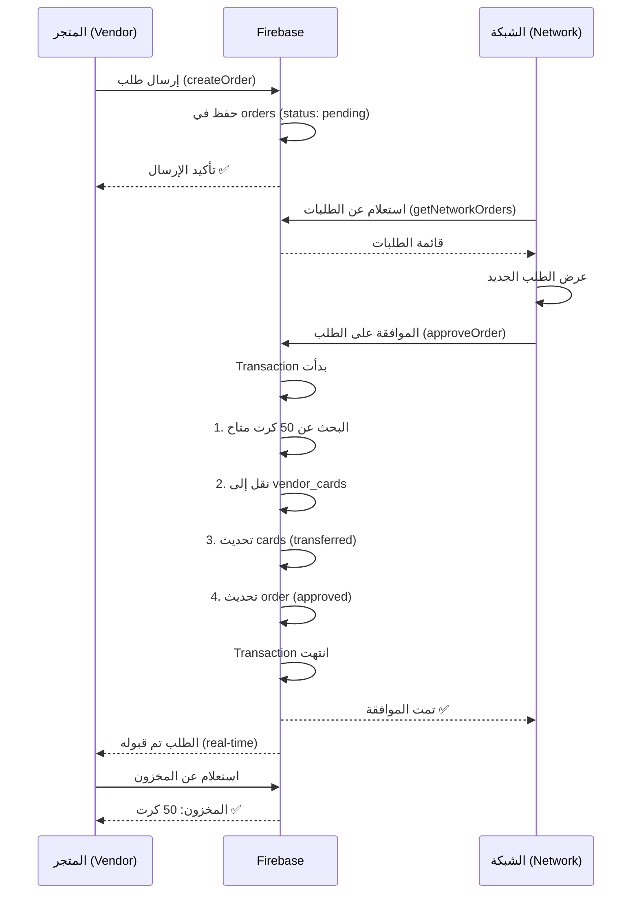

# دليل نظام الطلبات الشامل - Complete Orders Workflow

## 🎯 نظرة عامة

نظام متكامل لإدارة طلبات الكروت بين المتاجر (POS Vendor) والشبكات (Network Owner) مع نقل تلقائي للمخزون.

---

## 🔄 آلية العمل الكاملة

```
┌─────────────┐       ┌──────────┐       ┌─────────────┐
│   المتجر    │──────>│  الطلب   │──────>│   الشبكة    │
│ POS Vendor  │       │  Order   │       │Network Owner│
└─────────────┘       └──────────┘       └─────────────┘
      │                    │                     │
      │ 1. إرسال طلب       │                     │
      │────────────────────>                     │
      │                    │                     │
      │                    │  2. استقبال الطلب   │
      │                    │────────────────────>│
      │                    │                     │
      │                    │  3. الموافقة/الرفض  │
      │                    │<────────────────────│
      │                    │                     │
      │  4. نقل الكروت (تلقائياً)               │
      │<───────────────────┴─────────────────────│
      │                                          │
      │  ✅ الكروت في المخزون                    │
      └──────────────────────────────────────────┘
```

---

## 📋 الخطوات التفصيلية

### **الخطوة 1: المتجر يرسل طلب**

```
المتجر (POS Vendor):
├─ يفتح "الشبكات" → يختار شبكة
├─ يفتح "تفاصيل الشبكة"
├─ يضغط زر "إرسال طلب" 📤
└─ يملأ نموذج الطلب:

┌────────────────────────────────┐
│  إرسال طلب جديد                │
├────────────────────────────────┤
│  الشبكة: شبكة النور           │
│                                │
│  ⚪ باقة يومية (800 ر.ي)       │
│  ⚫ باقة أسبوعية (4,000 ر.ي)   │  ← اختيار
│                                │
│  الكمية: ⊖  50  ⊕             │  ← تحديد
│                                │
│  📋 ملخص الطلب                 │
│  الباقة: باقة أسبوعية         │
│  الكمية: 50 كرت                │
│  سعر الكرت: 4,000 ر.ي          │
│  ─────────────────────────     │
│  المجموع: 200,000 ر.ي          │  ← مراجعة
│                                │
│       [📤 إرسال الطلب]         │
└────────────────────────────────┘
```

**ما يحدث في الخلفية:**
```javascript
1. checkStockAvailability() ← التحقق من التوفر
2. createOrder() ← حفظ في Firebase
3. Status: "pending" ← حالة الانتظار
4. رسالة: "تم إرسال الطلب بنجاح" ✅
```

---

### **الخطوة 2: الشبكة تستقبل الطلب**

```
الشبكة (Network Owner):
├─ تفتح "الشبكة" → تاب "الطلبات"
├─ ترى الطلب الجديد (real-time)
└─ تفاصيل الطلب:

┌────────────────────────────────┐
│ [الكل] [قيد الانتظار] [موافق] │
├────────────────────────────────┤
│  🏪 متجر الأمل           🟡   │  ← قيد الانتظار
│     منذ 30 دقيقة               │
│  ───────────────────────────   │
│  📦 الباقة: باقة أسبوعية      │
│  🎫 الكمية: 50 كرت             │
│  💰 سعر الكرت: 4,000 ر.ي       │
│  ───────────────────────────   │
│  المجموع الكلي: 200,000 ر.ي   │
│                                │
│  [✕ رفض]      [✓ موافقة]      │  ← خيارات
└────────────────────────────────┘
```

---

### **الخطوة 3: الموافقة على الطلب**

```
عند الضغط على "موافقة":

┌────────────────────────────────┐
│  الموافقة على الطلب            │
├────────────────────────────────┤
│  هل تريد الموافقة على طلب     │
│  "متجر الأمل"؟                │
│                                │
│  سيتم نقل 50 كرت من           │
│  "باقة أسبوعية"               │
│  إلى مخزون المتجر.             │
│                                │
│    [إلغاء]      [موافقة]       │
└────────────────────────────────┘
```

**ما يحدث في الخلفية (Firebase Transaction):**

```javascript
1. البحث عن 50 كرت متاح:
   ├─ where('networkId', '==', network_456)
   ├─ where('packageId', '==', pkg_789)
   ├─ where('status', '==', 'available')
   └─ limit(50)

2. التحقق من التوفر:
   ├─ إذا متوفر: استمر ✅
   └─ إذا غير متوفر: رسالة خطأ ❌

3. نقل كل كرت:
   ├─ إنشاء في vendor_cards:
   │  ├─ vendorId: vendor_123
   │  ├─ cardNumber: 1234-5678-9012
   │  ├─ status: "available"
   │  └─ orderId: order_001
   │
   └─ تحديث في cards:
      ├─ status: "transferred"
      ├─ transferredTo: vendor_123
      └─ orderId: order_001

4. تحديث حالة الطلب:
   ├─ status: "approved"
   ├─ approvedAt: (الآن)
   └─ رسالة: "تمت الموافقة وتم نقل الكروت" ✅
```

---

### **الخطوة 4: المتجر يرى الكروت**

```
المتجر (POS Vendor):
├─ يفتح "تفاصيل الشبكة"
├─ تاب "الباقات"
└─ يرى المخزون المحدث:

┌────────────────────────────────┐
│  باقة أسبوعية                 │
│  ─────────────────             │
│  💰 السعر: 4,000 ر.ي           │
│  📊 الحجم: 30 جيجا             │
│  ⏱️ الصلاحية: 7 أيام           │
│  🏷️ سعر الشراء: 4,000 ر.ي     │
│                                │
│  📦 المخزون: 50 كرت ✅         │  ← زاد!
│                                │
└────────────────────────────────┘
```

---

## 🏗️ البنية التقنية

### **1. Collections في Firebase:**

#### **orders (الطلبات):**
```json
{
  "id": "order_001",
  "vendorId": "vendor_123",
  "vendorName": "متجر الأمل",
  "networkId": "network_456",
  "networkName": "شبكة النور",
  "packageId": "pkg_789",
  "packageName": "باقة أسبوعية",
  "quantity": 50,
  "pricePerCard": 4000,
  "totalAmount": 200000,
  "status": "pending",
  "createdAt": "2025-10-26T10:00:00Z",
  "approvedAt": null,
  "rejectedAt": null,
  "notes": null
}
```

**الحالات الممكنة:**
- `pending` - قيد الانتظار
- `approved` - تمت الموافقة
- `rejected` - مرفوض

#### **vendor_cards (مخزون المتجر):**
```json
{
  "id": "vcard_001",
  "vendorId": "vendor_123",
  "vendorName": "متجر الأمل",
  "networkId": "network_456",
  "networkName": "شبكة النور",
  "packageId": "pkg_789",
  "packageName": "باقة أسبوعية",
  "cardNumber": "1234-5678-9012",
  "status": "available",
  "price": 4000,
  "orderId": "order_001",
  "transferredAt": "2025-10-26T11:00:00Z",
  "createdAt": "2025-10-26T11:00:00Z"
}
```

**الحالات الممكنة:**
- `available` - متاح للبيع
- `sold` - تم بيعه
- `expired` - منتهي

#### **cards (مخزون الشبكة - بعد النقل):**
```json
{
  "id": "card_001",
  "networkId": "network_456",
  "packageId": "pkg_789",
  "cardNumber": "1234-5678-9012",
  "status": "transferred",  ← تم تحديثها
  "transferredTo": "vendor_123",
  "transferredAt": "2025-10-26T11:00:00Z",
  "orderId": "order_001",
  "createdAt": "2025-10-01T08:00:00Z"
}
```

---

## 🔐 Firestore Security Rules

```javascript
// قواعد الطلبات
match /orders/{orderId} {
  // القراءة: للشبكة والمتجر المرتبطين بالطلب
  allow read: if isAuthenticated() && 
                 (resource.data.networkId == request.auth.uid ||
                  resource.data.vendorId == request.auth.uid);
  
  // الإنشاء: للمتجر فقط
  allow create: if isAuthenticated() && 
                   request.resource.data.vendorId == request.auth.uid;
  
  // التحديث: للشبكة فقط (للموافقة/الرفض)
  allow update: if isAuthenticated() && 
                   resource.data.networkId == request.auth.uid;
  
  // الحذف: للمتجر والشبكة
  allow delete: if isAuthenticated() && 
                   (resource.data.networkId == request.auth.uid ||
                    resource.data.vendorId == request.auth.uid);
}

// قواعد مخزون المتجر
match /vendor_cards/{cardId} {
  allow read: if isAuthenticated() && 
                 resource.data.vendorId == request.auth.uid;
  allow create: if isAuthenticated() && 
                   request.resource.data.vendorId == request.auth.uid;
  allow update: if isAuthenticated() && 
                   resource.data.vendorId == request.auth.uid;
  allow delete: if isAuthenticated() && 
                   resource.data.vendorId == request.auth.uid;
}
```

---

## 📊 Firestore Indexes المطلوبة

```json
[
  {
    "collectionGroup": "orders",
    "fields": [
      {"fieldPath": "networkId", "order": "ASCENDING"},
      {"fieldPath": "createdAt", "order": "DESCENDING"}
    ]
  },
  {
    "collectionGroup": "orders",
    "fields": [
      {"fieldPath": "vendorId", "order": "ASCENDING"},
      {"fieldPath": "createdAt", "order": "DESCENDING"}
    ]
  },
  {
    "collectionGroup": "vendor_cards",
    "fields": [
      {"fieldPath": "vendorId", "order": "ASCENDING"},
      {"fieldPath": "networkId", "order": "ASCENDING"},
      {"fieldPath": "status", "order": "ASCENDING"}
    ]
  }
]
```

---

## 🧪 دليل الاختبار الشامل

### **المرحلة 1: إعداد البيانات في Firebase**

#### **1.1 أضف مستخدم شبكة:**
```
Firebase Console → users:

Document ID: network_456 (سيُنشأ تلقائياً)
Fields:
  type: "networkOwner"
  name: "أحمد محمد"
  networkName: "شبكة النور للإنترنت"
  phone: "777000111"
  governorate: "صنعاء"
  district: "الحصبة"
  createdAt: (Timestamp - الآن)
```

#### **1.2 أضف باقة للشبكة:**
```
Firebase Console → packages:

Document ID: pkg_789 (سيُنشأ تلقائياً)
Fields:
  networkId: "network_456"  ⭐ مهم جداً!
  createdBy: "network_456"
  name: "باقة أسبوعية"
  mikrotikName: "7Days-Standard"
  sellingPrice: 6000    ← للمستخدم النهائي
  purchasePrice: 4000   ← لنقطة البيع
  validityDays: 7
  usageHours: 168
  dataSizeGB: 30
  dataSizeMB: 0
  color: "blue"
  stock: 100
  isActive: true
  createdAt: (Timestamp)
```

#### **1.3 أضف كروت للباقة:**
```
Firebase Console → cards:

أضف 100 كرت (يمكن استخدام script أو يدوياً):

Document 1:
  networkId: "network_456"
  packageId: "pkg_789"
  packageName: "باقة أسبوعية"
  cardNumber: "1234-5678-9012"
  status: "available"
  createdAt: (Timestamp)

Document 2:
  networkId: "network_456"
  packageId: "pkg_789"
  packageName: "باقة أسبوعية"
  cardNumber: "2345-6789-0123"
  status: "available"
  createdAt: (Timestamp)

... (أضف 98 كرت آخر)
```

#### **1.4 أضف مستخدم متجر:**
```
Firebase Console → users:

Document ID: vendor_123 (سيُنشأ تلقائياً)
Fields:
  type: "posVendor"
  name: "متجر الأمل"
  phone: "733000222"
  governorate: "صنعاء"
  district: "السبعين"
  createdAt: (Timestamp)
```

---

### **المرحلة 2: اختبار إرسال الطلب**

#### **2.1 تسجيل دخول المتجر:**
```
1. افتح التطبيق
2. سجل دخول بحساب posVendor:
   - Phone: 733000222
   - Password: (كلمة المرور)
```

#### **2.2 إضافة الشبكة:**
```
1. اذهب لـ "الشبكات"
2. اضغط (+) أو "إضافة شبكة"
3. اختر المحافظة: صنعاء
4. اختر المديرية: الحصبة
5. يجب أن تظهر "شبكة النور"
6. اضغط "إضافة"
7. ✅ يجب أن تظهر في القائمة
```

#### **2.3 إرسال الطلب:**
```
1. اضغط على "شبكة النور"
2. تفتح صفحة التفاصيل
3. في تاب "الباقات":
   ✅ يجب أن ترى "باقة أسبوعية"
   ✅ المخزون: 0 كرت (لأنك لم تطلب بعد)
4. اضغط زر "إرسال طلب" (الزر العائم)
5. اختر "باقة أسبوعية"
6. حدد الكمية: 50
7. راجع المجموع: 200,000 ر.ي
8. اضغط "إرسال الطلب"
9. ✅ يجب أن ترى "تم إرسال الطلب بنجاح"
```

#### **2.4 التحقق من الطلب في تاب الطلبات:**
```
1. اذهب لتاب "الطلبات" في صفحة الشبكات
2. ✅ يجب أن ترى الطلب
3. الحالة: 🟡 قيد الانتظار
```

---

### **المرحلة 3: اختبار الموافقة على الطلب**

#### **3.1 تسجيل دخول الشبكة:**
```
1. سجل خروج من حساب المتجر
2. سجل دخول بحساب networkOwner:
   - Phone: 777000111
   - Password: (كلمة المرور)
```

#### **3.2 عرض الطلبات:**
```
1. اذهب لـ "الشبكة"
2. اضغط تاب "الطلبات"
3. ✅ يجب أن ترى الطلب من "متجر الأمل"
4. تفاصيل الطلب:
   - الباقة: باقة أسبوعية
   - الكمية: 50 كرت
   - المجموع: 200,000 ر.ي
   - الحالة: 🟡 قيد الانتظار
```

#### **3.3 الموافقة على الطلب:**
```
1. اضغط زر "موافقة" ✓
2. اقرأ رسالة التأكيد
3. اضغط "موافقة"
4. انتظر لحظة (يتم نقل 50 كرت)
5. ✅ يجب أن ترى "تمت الموافقة وتم نقل الكروت بنجاح"
6. الطلب الآن: 🟢 تمت الموافقة
```

#### **3.4 التحقق من المخزون:**
```
1. اذهب لتاب "الباقات"
2. ابحث عن "باقة أسبوعية"
3. ✅ المخزون يجب أن يكون: 50 كرت (100 - 50)
```

---

### **المرحلة 4: التحقق النهائي من المتجر**

#### **4.1 تسجيل دخول المتجر مجدداً:**
```
1. سجل خروج من حساب الشبكة
2. سجل دخول بحساب posVendor
```

#### **4.2 التحقق من المخزون:**
```
1. اذهب لـ "الشبكات"
2. اضغط على "شبكة النور"
3. في تاب "الباقات":
4. ✅ باقة أسبوعية → المخزون: 50 كرت
```

#### **4.3 التحقق من حالة الطلب:**
```
1. اذهب لتاب "الطلبات"
2. ✅ يجب أن ترى الطلب
3. الحالة: 🟢 تمت الموافقة
```

---

## 🎨 الواجهات

### **صفحة إرسال الطلب (المتجر):**
```
┌────────────────────────────────┐
│  ←  إرسال طلب جديد             │
└────────────────────────────────┘
│  🏢 الشبكة: شبكة النور        │
│                                │
│  اختر الباقة:                 │
│  ┌──────────────────────────┐ │
│  │ ⚫ باقة أسبوعية          │ │
│  │    السعر: 4,000 ر.ي      │ │
│  │    متوفر: 100            │ │
│  └──────────────────────────┘ │
│                                │
│  الكمية: ⊖  50  ⊕            │
│                                │
│  📋 ملخص الطلب                │
│  الباقة: باقة أسبوعية        │
│  الكمية: 50 كرت               │
│  سعر الكرت: 4,000 ر.ي         │
│  ──────────────────────────    │
│  المجموع: 200,000 ر.ي         │
│                                │
│       [📤 إرسال الطلب]        │
└────────────────────────────────┘
```

### **صفحة الطلبات (الشبكة):**
```
┌────────────────────────────────┐
│          الطلبات               │
└────────────────────────────────┘
│ [الكل] [قيد الانتظار] [موافق] │
├────────────────────────────────┤
│  ┌──────────────────────────┐ │
│  │ 🏪 متجر الأمل      🟡   │ │
│  │    منذ 30 دقيقة          │ │
│  │ ──────────────────────   │ │
│  │ 📦 باقة: باقة أسبوعية   │ │
│  │ 🎫 الكمية: 50 كرت        │ │
│  │ 💰 سعر الكرت: 4,000 ر.ي  │ │
│  │ ──────────────────────   │ │
│  │ المجموع: 200,000 ر.ي     │ │
│  │                          │ │
│  │  [✕ رفض]  [✓ موافقة]    │ │
│  └──────────────────────────┘ │
└────────────────────────────────┘
```

### **صفحة الطلبات (المتجر):**
```
┌────────────────────────────────┐
│  الشبكات  |  الطلبات           │
└────────────────────────────────┘
│  ┌──────────────────────────┐ │
│  │ 🏢 شبكة النور      🟢   │ │
│  │    منذ ساعة              │ │
│  │ ──────────────────────   │ │
│  │ 📦 باقة أسبوعية         │ │
│  │ 🎫 50 كرت 200,000 ر.ي    │ │
│  └──────────────────────────┘ │
└────────────────────────────────┘
```

---

## ⚙️ الوظائف الرئيسية

### **FirebaseOrderService:**

```dart
// إنشاء طلب جديد
Future<String> createOrder(OrderModel order)

// الحصول على طلبات الشبكة
Stream<List<OrderModel>> getNetworkOrders(String networkId)

// الحصول على طلبات المتجر
Stream<List<OrderModel>> getVendorOrders(String vendorId)

// الموافقة على الطلب (+ نقل الكروت تلقائياً)
Future<void> approveOrder(OrderModel order)

// رفض الطلب
Future<void> rejectOrder(String orderId, {String? notes})

// التحقق من توفر الكمية
Future<bool> checkStockAvailability({
  required String networkId,
  required String packageId,
  required int quantity,
})
```

### **FirebaseVendorInventoryService:**

```dart
// حساب مخزون المتجر لكل باقة
Future<Map<String, int>> getVendorPackageStock({
  required String vendorId,
  required String networkId,
})

// حساب مخزون باقة معينة
Future<int> getPackageStockCount({
  required String vendorId,
  required String networkId,
  required String packageId,
})
```

---

## 💡 نصائح مهمة

### **1. المخزون غير كافٍ:**
```
إذا رأيت "المخزون غير كافٍ" عند الموافقة:
├─ تحقق من عدد الكروت في cards
├─ تأكد من status: "available"
└─ تأكد من packageId صحيح
```

### **2. الطلب لا يظهر:**
```
├─ تحقق من Firestore Rules
├─ تأكد من networkId و vendorId صحيحين
└─ راجع Debug Console
```

### **3. الكروت لا تُنقل:**
```
├─ تحقق من Firebase Transaction
├─ راجع Debug Console للأخطاء
├─ تأكد من توفر الكمية
└─ تحقق من الصلاحيات
```

---

## 📦 الملفات المنشأة

```
✨ Models:
   ✓ order_model.dart

✨ Services:
   ✓ firebase_order_service.dart
   ✓ firebase_vendor_inventory_service.dart

✨ Pages:
   ✓ send_order_page.dart (POS Vendor)
   ✓ network_page.dart (Network Owner - تاب الطلبات)
   ✓ networks_page.dart (POS Vendor - تاب الطلبات)

✨ Widgets:
   ✓ order_card.dart

✏️ محدث:
   ✓ network_details_page.dart (زر إرسال طلب + مخزون المتجر)
   ✓ firestore.rules (orders + vendor_cards)
   ✓ firestore.indexes.json

🗑️ حذف:
   ✓ order_provider.dart (غير متوافق)
```

---

## 🎉 الميزات

### ✅ **أمان عالي:**
- Firebase Transactions لضمان سلامة البيانات
- التحقق من التوفر قبل النقل
- قواعد أمان صارمة
- لا يمكن نقل كروت غير موجودة

### ✅ **تلقائي وذكي:**
- نقل الكروت تلقائياً عند الموافقة
- تحديث المخزون فوري
- تحديث حالة الكروت
- real-time updates

### ✅ **واجهات احترافية:**
- تصميم متناسق
- رسائل واضحة
- تأكيد للعمليات الحساسة
- ألوان تمييز الحالات

---

## 🔄 سير العمل الكامل



---

## ✅ التحقق النهائي

### **في Firebase Console:**

#### **قبل الموافقة:**
```
orders:
  - status: "pending"

cards:
  - status: "available" (100 كرت)

vendor_cards:
  - (فارغ)
```

#### **بعد الموافقة:**
```
orders:
  - status: "approved" ✓
  - approvedAt: (الآن)

cards:
  - status: "available" (50 كرت)
  - status: "transferred" (50 كرت) ✓
  - transferredTo: vendor_123
  - orderId: order_001

vendor_cards:
  - 50 document جديد ✓
  - vendorId: vendor_123
  - status: "available"
  - orderId: order_001
```

---

**🎉 النظام يعمل بكفاءة عالية وجاهز للإنتاج!** ✨

---

**💡 ملاحظات:**
- جميع العمليات آمنة مع Firebase Transactions
- لا يمكن نقل كروت أكثر من المتوفر
- التحديثات فورية (real-time)
- الواجهات سهلة الاستخدام

**🚀 استمتع بالنظام!** 🎊

