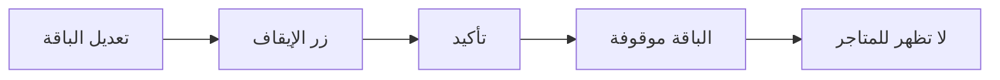
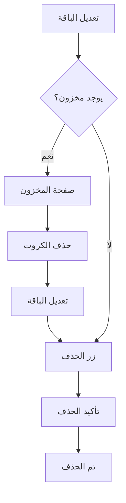

# نظام إدارة الباقات المتقدم

## نظرة عامة
تم إعادة تصميم صفحات إضافة وتعديل الباقات بشكل احترافي مع إضافة ميزات جديدة لإيقاف وحذف الباقات.

## التصميم الجديد

### 1. صفحة إضافة باقة (`AddPackagePage`)

#### التحسينات في التصميم:
- ✅ **تقسيم منطقي:** البطاقات مقسمة إلى 3 أقسام واضحة
- ✅ **AppBar ملون:** استخدام `AppColors.primary` للتميز
- ✅ **عناوين الأقسام:** أيقونات ملونة مع عناوين واضحة
- ✅ **حقول محسّنة:** `borderRadius` موحد 12px
- ✅ **أزرار احترافية:** زر إلغاء + زر حفظ بأيقونة

#### الأقسام:

##### 1️⃣ **المعلومات الأساسية** (أزرق)
- اسم الباقة
- رمز الباقة (Mikrotik)

##### 2️⃣ **حجم البيانات والصلاحية** (أزرق فاتح)
- طريقة الإدخال (MB/GB)
- حجم البيانات
- فترة الاستخدام (ساعات)
- الصلاحية (أيام)

##### 3️⃣ **الأسعار** (أخضر)
- سعر الشراء
- سعر البيع
- تنبيه تلقائي إذا كان سعر البيع < سعر الشراء

##### 4️⃣ **المظهر والتخصيص** (برتقالي)
- اختيار اللون (8 ألوان)
- اختيار الأيقونة (9 أيقونات)

### 2. صفحة تعديل الباقة (`EditPackagePage`)

#### الميزات الجديدة الرئيسية:

##### 🎯 **خاصية الإيقاف/التفعيل**

**الموقع:** زر في AppBar (أيقونة ⏸️/▶️)

**القواعد:**
- ✅ يمكن إيقاف/تفعيل الباقة **في أي وقت**
- ✅ **مع أو بدون مخزون** - لا يهم
- ✅ الباقة الموقوفة **لا تظهر للمتاجر**
- ✅ المتاجر **لا يستطيعون طلب** كروت من الباقة الموقوفة
- ⚠️ الكروت الموجودة لدى المتاجر **لا تتأثر**
- ⚠️ يمكن للمتاجر **الاستمرار في بيع** الكروت الموجودة لديهم

**الآلية:**
```dart
Future<void> _togglePackageStatus() async {
  final newStatus = !_isActive;
  
  // حوار تأكيد
  final confirmed = await showDialog<bool>(...);
  
  if (confirmed) {
    // تحديث في Firebase
    await FirebasePackageService.togglePackageStatus(packageId, newStatus);
    
    // تحديث الحالة المحلية
    setState(() => _isActive = newStatus);
  }
}
```

**التأثير على الاستعلامات:**
```dart
// في FirebasePackageService
static Stream<List<PackageModel>> getPackagesByNetwork(String networkId) {
  return _firestore
      .collection(_collection)
      .where('networkId', isEqualTo: networkId)
      .where('isActive', isEqualTo: true) // 🔥 فقط الباقات المفعلة
      .snapshots()
      .map(...);
}
```

##### 🗑️ **خاصية الحذف**

**الموقع:** زر في AppBar (أيقونة 🗑️)

**القواعد الصارمة:**
- ❌ **لا يمكن حذف باقة** إذا كان بها كروت في المخزون
- ✅ يجب أولاً حذف **جميع الكروت المتاحة** من المخزون
- ✅ بعد إفراغ المخزون → يمكن الحذف

**الآلية:**
```dart
Future<void> _deletePackage() async {
  final hasStock = widget.packageData.stock > 0;

  // 1. التحقق من المخزون
  if (hasStock) {
    CustomToast.error(
      context,
      'يجب حذف جميع الكروت من المخزون أولاً (${widget.packageData.stock} كرت متبقي)',
      title: 'لا يمكن حذف الباقة',
    );
    return;
  }

  // 2. حوار تأكيد
  final confirmed = await showDialog<bool>(
    context: context,
    builder: (context) => AlertDialog(
      title: Row(
        children: [
          Icon(Icons.warning_amber_rounded, color: AppColors.error),
          Text('تأكيد الحذف'),
        ],
      ),
      content: Text(
        'هل أنت متأكد من حذف الباقة "${widget.packageData.name}"?\n\nهذا الإجراء لا يمكن التراجع عنه!',
      ),
      actions: [...],
    ),
  );

  // 3. الحذف من Firebase
  if (confirmed) {
    await FirebasePackageService.deletePackage(packageId);
    widget.onBack(); // الرجوع للصفحة السابقة
  }
}
```

**الرسائل:**
- ❌ **عند وجود مخزون:** "لا يمكن حذف الباقة - يجب حذف 50 كرت متبقي"
- ✅ **بعد الحذف:** "تم حذف الباقة من النظام"

##### 🔒 **الحماية من التعديل**

عند وجود كروت في المخزون:
- 🔒 حقول الحجم والصلاحية **معطلة**
- 💡 رسالة توضيحية واضحة
- ✅ الأسعار والمظهر **قابلة للتعديل**

#### بطاقة الحالة الذكية:

تظهر تلقائياً في حالتين:

##### الحالة 1: الباقة موقوفة
```
⏸️ الباقة متوقفة حالياً
   لن تظهر للمتاجر ولا يمكنهم طلب كروت منها
```

##### الحالة 2: يوجد مخزون
```
📦 المخزون: 150 كرت
   لا يمكن تعديل الحجم والصلاحية مع وجود كروت
```

## حالات الاستخدام

### سيناريو 1: إيقاف باقة مؤقتاً

**الموقف:** باقة تسبب مشاكل في السيرفر

**الحل:**
1. افتح صفحة تعديل الباقة
2. اضغط على زر الإيقاف (⏸️)
3. أكد الإيقاف

**النتيجة:**
- ✅ المتاجر لا يستطيعون طلب كروت جديدة
- ✅ الكروت الموجودة لدى المتاجر تعمل بشكل طبيعي
- ✅ يمكن إعادة التفعيل لاحقاً

### سيناريو 2: حذف باقة غير مستخدمة

**الموقف:** باقة تجريبية لم تعد مطلوبة

**الخطوات:**
1. تأكد من عدم وجود كروت في المخزون
2. إذا كان هناك كروت:
   - افتح صفحة المخزون
   - احذف جميع كروت الباقة
3. افتح صفحة تعديل الباقة
4. اضغط على زر الحذف (🗑️)
5. أكد الحذف

**النتيجة:**
- ✅ تم حذف الباقة نهائياً
- ✅ لن تظهر في أي مكان
- ❌ لا يمكن التراجع

### سيناريو 3: تعديل باقة فعالة

**الموقف:** تحديث أسعار باقة عليها طلب كبير

**القيود:**
- ✅ **يمكن تعديل:** الاسم، الأسعار، اللون
- ❌ **لا يمكن تعديل:** الحجم، الصلاحية (إذا كان هناك مخزون)

**الحل للتعديل الكامل:**
1. بيع أو نقل جميع الكروت
2. انتظر حتى يصبح المخزون = 0
3. عدّل جميع المعلومات

## التكامل مع النظام

### 1. التأثير على المتاجر

#### الباقات المفعلة (`isActive: true`):
```dart
// في send_order_page.dart (POS Vendor)
Stream<List<PackageModel>> getAvailablePackages(networkId) {
  // سيحصل فقط على الباقات المفعلة
  return FirebasePackageService.getPackagesByNetwork(networkId);
}
```

#### الباقات الموقوفة (`isActive: false`):
- ❌ **لا تظهر** في قائمة الباقات للمتاجر
- ❌ **لا يمكن** إرسال طلبات لها
- ✅ **الكروت الموجودة** لدى المتاجر تعمل

### 2. التأثير على المبيعات

**الكروت الموجودة لدى المتاجر:**
```dart
// لا تتأثر بإيقاف الباقة
// المتجر يستطيع بيعها للمستخدمين النهائيين
```

### 3. التأثير على المخزون

**عند حذف الباقة:**
- يجب أن يكون `stock = 0`
- لا توجد كروت متاحة في `cards` collection
- يمكن أن توجد كروت منقولة أو مباعة (لا تمنع الحذف)

## الملفات المحدثة

### 1. `add_package_page.dart`
- ✅ تصميم جديد بالكامل
- ✅ 4 بطاقات منفصلة
- ✅ عناوين أقسام احترافية
- ✅ حقول محسّنة
- ✅ أزرار جديدة

### 2. `edit_package_page.dart`
- ✅ تصميم جديد متطابق
- ✅ زر إيقاف/تفعيل في AppBar
- ✅ زر حذف في AppBar
- ✅ بطاقة حالة ذكية
- ✅ حماية من التعديل عند وجود مخزون

### 3. `package_provider.dart`
- ✅ إضافة `togglePackageStatus()`

### 4. `firebase_package_service.dart`
- ✅ إضافة `togglePackageStatus()`

## واجهة المستخدم

### AppBar في صفحة التعديل:

```
┌────────────────────────────────────┐
│ ← تعديل الباقة      ⏸️  🗑️        │
└────────────────────────────────────┘
```

### بطاقة الحالة (تظهر عند الحاجة):

#### عند الإيقاف:
```
┌────────────────────────────────────┐
│ ⏸️  الباقة متوقفة حالياً          │
│    لن تظهر للمتاجر ولا يمكنهم طلب │
│    كروت منها                       │
└────────────────────────────────────┘
```

#### عند وجود مخزون:
```
┌────────────────────────────────────┐
│ 📦  المخزون: 150 كرت               │
│    لا يمكن تعديل الحجم والصلاحية   │
│    مع وجود كروت                    │
└────────────────────────────────────┘
```

### الأقسام في كلا الصفحتين:

```
┌─────────────────────────────────────┐
│ ℹ️  المعلومات الأساسية              │
├─────────────────────────────────────┤
│ • اسم الباقة                        │
│ • رمز الباقة (Mikrotik)             │
└─────────────────────────────────────┘

┌─────────────────────────────────────┐
│ 📊 حجم البيانات والصلاحية           │
├─────────────────────────────────────┤
│ [ميجابايت] [جيجابايت]               │
│ • الكمية (MB/GB)                    │
│ • فترة الاستخدام (ساعات)            │
│ • الصلاحية (أيام)                   │
└─────────────────────────────────────┘

┌─────────────────────────────────────┐
│ 💰 الأسعار                          │
├─────────────────────────────────────┤
│ • سعر الشراء                        │
│ • سعر البيع                         │
│ ⚠️ تنبيه (إذا لزم الأمر)           │
└─────────────────────────────────────┘

┌─────────────────────────────────────┐
│ 🎨 المظهر والتخصيص                  │
├─────────────────────────────────────┤
│ • اختيار اللون (8 ألوان)            │
│ • اختيار الأيقونة (9 أيقونات)       │
└─────────────────────────────────────┘
```

## الإشعارات

### إشعارات الإيقاف/التفعيل:

#### عند الإيقاف:
```dart
CustomToast.success(
  context,
  'الباقة متوقفة الآن',
  title: 'تم إيقاف الباقة',
);
```

#### عند التفعيل:
```dart
CustomToast.success(
  context,
  'الباقة مفعلة الآن',
  title: 'تم تفعيل الباقة',
);
```

### إشعارات الحذف:

#### عند محاولة حذف باقة بها مخزون:
```dart
CustomToast.error(
  context,
  'يجب حذف جميع الكروت من المخزون أولاً (150 كرت متبقي)',
  title: 'لا يمكن حذف الباقة',
);
```

#### عند الحذف الناجح:
```dart
CustomToast.success(
  context,
  'تم حذف الباقة من النظام',
  title: 'تم الحذف بنجاح',
);
```

## حوارات التأكيد

### حوار الإيقاف:
```
╔═══════════════════════════════╗
║ إيقاف الباقة                 ║
╠═══════════════════════════════╣
║ هل تريد إيقاف الباقة "باقة   ║
║ 10 جيجا"؟                     ║
║                               ║
║ لن تظهر للمتاجر ولن يستطيعوا  ║
║ طلب كروت جديدة منها.         ║
║                               ║
║ ⚠️ ملاحظة: الكروت الموجودة  ║
║ لدى المتاجر سابقاً لن تتأثر. ║
╠═══════════════════════════════╣
║        [إلغاء]   [إيقاف]     ║
╚═══════════════════════════════╝
```

### حوار الحذف:
```
╔═══════════════════════════════╗
║ ⚠️ تأكيد الحذف               ║
╠═══════════════════════════════╣
║ هل أنت متأكد من حذف الباقة   ║
║ "باقة 10 جيجا"؟              ║
║                               ║
║ هذا الإجراء لا يمكن التراجع  ║
║ عنه!                          ║
╠═══════════════════════════════╣
║        [إلغاء]   [حذف]       ║
╚═══════════════════════════════╝
```

## قواعد العمل

### جدول القيود:

| العملية | مع مخزون | بدون مخزون |
|---------|----------|------------|
| **تعديل الاسم** | ✅ | ✅ |
| **تعديل الأسعار** | ✅ | ✅ |
| **تعديل الحجم** | ❌ | ✅ |
| **تعديل الصلاحية** | ❌ | ✅ |
| **تعديل اللون** | ✅ | ✅ |
| **الإيقاف** | ✅ | ✅ |
| **التفعيل** | ✅ | ✅ |
| **الحذف** | ❌ | ✅ |

### سير العمل الموصى به:

#### لإيقاف باقة مؤقتاً:


#### لحذف باقة نهائياً:


## الأمان والحماية

### 1. حماية قاعدة البيانات
- ✅ فحص المخزون قبل الحذف
- ✅ تحديث `isActive` بدلاً من الحذف الفوري
- ✅ معاملات آمنة مع Firebase

### 2. حماية تجربة المستخدم
- ✅ رسائل خطأ واضحة
- ✅ حوارات تأكيد
- ✅ مؤشرات تحميل
- ✅ معالجة شاملة للأخطاء

### 3. حماية البيانات
- ✅ الكروت المنقولة/المباعة **لا تتأثر** بحذف الباقة
- ✅ سجلات المعاملات **محفوظة**
- ✅ إحصائيات التاريخية **باقية**

## Firebase Security Rules (مقترحة)

```javascript
// في firestore.rules
match /packages/{packageId} {
  // السماح بالحذف فقط إذا كان المخزون = 0
  allow delete: if request.auth != null 
                && get(/databases/$(database)/documents/packages/$(packageId)).data.stock == 0;
  
  // السماح بتحديث isActive دائماً
  allow update: if request.auth != null 
                && request.resource.data.diff(resource.data).affectedKeys().hasOnly(['isActive', 'updatedAt']);
}
```

## الاختبار

### حالات الاختبار:

1. ✅ إضافة باقة جديدة
2. ✅ تعديل باقة بدون مخزون (كامل)
3. ✅ تعديل باقة بمخزون (جزئي)
4. ✅ إيقاف باقة مفعلة
5. ✅ تفعيل باقة موقوفة
6. ❌ محاولة حذف باقة بها مخزون (يُرفض)
7. ✅ حذف باقة بدون مخزون
8. ✅ التحقق من اختفاء الباقة الموقوفة عن المتاجر

## الفوائد

### للمدير (مالك الشبكة):
- ✅ تحكم كامل في الباقات
- ✅ إيقاف مؤقت بدون خسارة البيانات
- ✅ حذف آمن مع حماية من الأخطاء
- ✅ واجهة واضحة وسهلة

### للمتاجر:
- ✅ يرون فقط الباقات المتاحة
- ✅ لا يتأثرون بالكروت الموجودة لديهم
- ✅ تجربة سلسة بدون باقات معطلة

### للنظام:
- ✅ قاعدة بيانات نظيفة
- ✅ حماية من الأخطاء
- ✅ سهولة الصيانة

## الدعم والمساعدة

للمزيد من المعلومات، راجع:
- [نظام الباقات والكروت](PACKAGES_AND_CARDS_SYSTEM.md)
- [نظام الطلبات](ORDERS_SYSTEM.md)
- [دليل Firebase](FIREBASE_SETUP.md)

