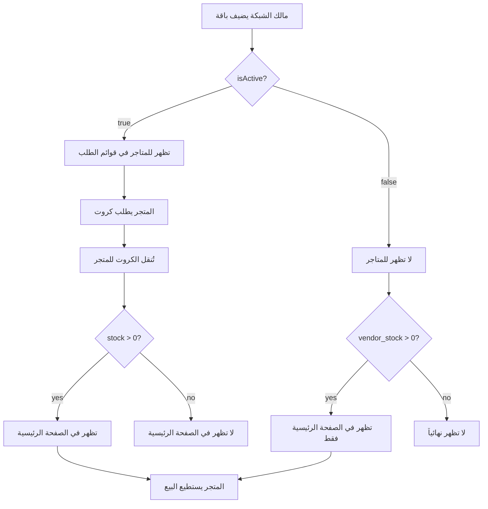

# نظام حالة الباقات والرؤية

## نظرة عامة
نظام متقدم لإدارة رؤية الباقات بناءً على حالتها (مفعلة/موقوفة) ومخزون المتاجر، مع واجهة مستخدم واضحة تعرض الحالة بشكل مرئي.

## المفاهيم الأساسية

### 1. حالة الباقة (`isActive`)

#### الحالات الممكنة:
- **مفعلة** (`isActive: true`): الباقة تعمل بشكل طبيعي
- **موقوفة** (`isActive: false`): الباقة معطلة مؤقتاً

### 2. المخزون (`stock`)

#### أنواع المخزون:
- **مخزون الشبكة** (`stock`): الكروت المتاحة لدى مالك الشبكة
- **مخزون المتجر** (`vendor_cards`): الكروت المنقولة للمتاجر

## قواعد الرؤية

### لمالك الشبكة (Network Owner):

| الحالة | المخزون | الظهور | المظهر |
|--------|---------|--------|---------|
| مفعلة | > 0 | ✅ يظهر | عادي |
| مفعلة | = 0 | ✅ يظهر | عادي |
| موقوفة | > 0 | ✅ يظهر | ⏸️ علامة + رمادي |
| موقوفة | = 0 | ✅ يظهر | ⏸️ علامة + رمادي |

**القاعدة:** يرى **جميع الباقات** مع علامة واضحة للموقوفة

### للمتاجر (POS Vendors):

#### في قوائم الباقات:
| الحالة | المخزون | الظهور |
|--------|---------|--------|
| مفعلة | أي قيمة | ✅ يظهر |
| موقوفة | أي قيمة | ❌ لا يظهر |

**القاعدة:** يرى **الباقات المفعلة فقط**

#### في الصفحة الرئيسية (أزرار التخصيص):
| الحالة | مخزون المتجر | الظهور |
|--------|--------------|--------|
| مفعلة | > 0 | ✅ يظهر |
| مفعلة | = 0 | ❌ لا يظهر |
| موقوفة | > 0 | ✅ يظهر |
| موقوفة | = 0 | ❌ لا يظهر |

**القاعدة:** يظهر فقط الباقات **التي لديه منها كروت** بغض النظر عن حالتها

## التطبيق التقني

### 1. الاستعلامات في Firebase

#### للشبكة (جميع الباقات):
```dart
// في FirebasePackageService
static Stream<List<PackageModel>> getPackagesByNetwork(String networkId) {
  return _firestore
      .collection(_collection)
      .where('networkId', isEqualTo: networkId)
      // لا فلتر على isActive - يظهر الكل
      .orderBy('createdAt', descending: true)
      .snapshots()
      .map(...);
}
```

#### للمتاجر (المفعلة فقط):
```dart
static Stream<List<PackageModel>> getActivePackagesByNetwork(String networkId) {
  return _firestore
      .collection(_collection)
      .where('networkId', isEqualTo: networkId)
      .where('isActive', isEqualTo: true) // 🔥 المفعلة فقط
      .orderBy('createdAt', descending: true)
      .snapshots()
      .map(...);
}
```

### 2. واجهة المستخدم - بطاقة الباقة

#### علامة الإيقاف:
```dart
// في PackageCard
if (!data.isActive)
  Container(
    padding: EdgeInsets.symmetric(horizontal: 12.w, vertical: 8.h),
    decoration: BoxDecoration(
      color: AppColors.warning.withValues(alpha: 0.15),
      borderRadius: BorderRadius.circular(10.r),
      border: Border.all(
        color: AppColors.warning.withValues(alpha: 0.4),
      ),
    ),
    child: Row(
      children: [
        Icon(Icons.pause_circle, color: AppColors.warning),
        SizedBox(width: 6.w),
        Text('الباقة متوقفة'),
      ],
    ),
  ),
```

#### الأيقونة الرمادية:
```dart
Container(
  decoration: BoxDecoration(
    color: data.isActive
        ? bg  // اللون العادي
        : AppColors.gray400, // 🎨 رمادي للموقوفة
    borderRadius: BorderRadius.circular(14.r),
  ),
  child: Icon(iconData, color: Colors.white),
),
```

### 3. فلترة الباقات في الصفحة الرئيسية

```dart
// في _CustomNetworkSection
FutureBuilder<Map<String, int>>(
  future: FirebaseVendorInventoryService.getVendorPackageStock(
    vendorId: vendorId,
    networkId: networkId,
  ),
  builder: (context, stockSnapshot) {
    final packageStock = stockSnapshot.data ?? {};

    // ✅ فلترة الباقات - فقط التي بها كروت
    final packagesWithStock = packages.where((pkg) {
      final stock = packageStock[pkg.id] ?? 0;
      return stock > 0; // 🔥 فقط التي بها مخزون
    }).toList();

    // إذا لم يكن هناك باقات بها كروت
    if (packagesWithStock.isEmpty) {
      return const SizedBox.shrink(); // لا نعرض شيء
    }

    return _PackagesWrap(
      packages: packagesWithStock,
      packageStock: packageStock,
    );
  },
)
```

## السيناريوهات

### سيناريو 1: باقة مفعلة بدون كروت لدى المتجر

**الوضع:**
- `isActive: true`
- `stock` (الشبكة): 100 كرت
- `vendor_stock` (المتجر): 0 كرت

**النتيجة:**
- ✅ **في قوائم الطلبات:** تظهر (يستطيع الطلب)
- ❌ **في الصفحة الرئيسية:** لا تظهر (لا يوجد كروت للبيع)

### سيناريو 2: باقة موقوفة بكروت لدى المتجر

**الوضع:**
- `isActive: false`
- `stock` (الشبكة): 50 كرت
- `vendor_stock` (المتجر): 10 كرت

**النتيجة:**
- ❌ **في قوائم الطلبات:** لا تظهر (باقة موقوفة)
- ✅ **في الصفحة الرئيسية:** تظهر (لديه كروت للبيع)

### سيناريو 3: باقة مفعلة بكروت لدى المتجر

**الوضع:**
- `isActive: true`
- `stock` (الشبكة): 200 كرت
- `vendor_stock` (المتجر): 50 كرت

**النتيجة:**
- ✅ **في قوائم الطلبات:** تظهر (يستطيع الطلب)
- ✅ **في الصفحة الرئيسية:** تظهر (لديه كروت للبيع)

### سيناريو 4: باقة موقوفة بدون كروت

**الوضع:**
- `isActive: false`
- `stock` (الشبكة): 0 كرت
- `vendor_stock` (المتجر): 0 كرت

**النتيجة:**
- ❌ **في قوائم الطلبات:** لا تظهر (باقة موقوفة)
- ❌ **في الصفحة الرئيسية:** لا تظهر (لا كروت)

## حقل فترة الاستخدام الاختياري

### القاعدة الجديدة:
- إذا كان `usageWindowHours = 0` أو فارغ → يعرض "**مفتوح**"
- إذا كان `usageWindowHours > 0` → يعرض "**X ساعة**"

### التطبيق:

#### في بطاقة الباقة:
```dart
_MetaChip(
  label: data.usageWindowHours > 0
      ? '${data.usageWindowHours} ساعة'
      : 'مفتوح', // 🔓
  icon: Icons.access_time_outlined,
),
```

#### في صفحة الإضافة:
```dart
TextFormField(
  controller: _hoursController,
  decoration: InputDecoration(
    labelText: 'فترة الاستخدام (اختياري)',
    hintText: 'اتركه فارغاً للاستخدام المفتوح',
  ),
  validator: (v) {
    if (v == null || v.trim().isEmpty) {
      return null; // ✅ اختياري
    }
    // ...
  },
)
```

### المعنى:
- **مفتوح:** يمكن استخدام الباقة طوال فترة الصلاحية (X يوم) بدون قيد على الساعات
- **X ساعة:** يمكن استخدام الباقة لمدة X ساعة فقط خلال فترة الصلاحية

## قواعد الحذف المحدثة

### القاعدة الصارمة:
```
يمكن حذف الباقة فقط إذا كان stock = 0
(أي لا توجد كروت في "المتاحة" فقط)
```

### لا يؤثر على الحذف:
- ✅ الكروت **المنقولة** للمتاجر
- ✅ الكروت **المباعة** للمستخدمين
- ✅ حالة الباقة (مفعلة/موقوفة)

### التطبيق:
```dart
Future<void> _deletePackage() async {
  final hasStock = widget.packageData.stock > 0;

  if (hasStock) {
    CustomToast.error(
      context,
      'يجب حذف جميع الكروت من المخزون أولاً (${widget.packageData.stock} كرت متبقي)',
      title: 'لا يمكن حذف الباقة',
    );
    return;
  }

  // ✅ السماح بالحذف
  // المتاجر يستطيعون الاستمرار ببيع الكروت الموجودة لديهم
}
```

## خريطة الصفحات والدوال

### الصفحات التي تستخدم `getPackagesByNetwork` (جميع الباقات):
1. ✅ `network_page.dart` - تبويب الباقات (مالك الشبكة)

### الصفحات التي تستخدم `getActivePackagesByNetwork` (المفعلة فقط):
1. ✅ `sale_process_page.dart` - صفحة البيع
2. ✅ `send_order_page.dart` - صفحة إرسال الطلب
3. ✅ `network_details_page.dart` - تفاصيل الشبكة
4. ✅ `pos_vendor_home_page.dart` - الصفحة الرئيسية (قوائم الباقات)

### فلترة إضافية في الصفحة الرئيسية:
```dart
// في pos_vendor_home_page.dart
final packagesWithStock = packages.where((pkg) {
  final stock = packageStock[pkg.id] ?? 0;
  return stock > 0; // 🎯 فقط الباقات بمخزون
}).toList();
```

## المظهر البصري

### بطاقة باقة مفعلة:
```
┌─────────────────────────────────────┐
│ 📶 [أيقونة ملونة]  باقة 10 جيجا    │
│    10 GB • 30 يوم • مفتوح           │
│    150 متوفر                        │
│                        2,000 ر.ي ← │
└─────────────────────────────────────┘
```

### بطاقة باقة موقوفة:
```
┌─────────────────────────────────────┐
│ ⏸️ الباقة متوقفة                   │
├─────────────────────────────────────┤
│ 📶 [أيقونة رمادية]  باقة 10 جيجا   │
│    10 GB • 30 يوم • 48 ساعة        │
│    50 متوفر                         │
│                        2,000 ر.ي ← │
└─────────────────────────────────────┘
```

### بطاقة باقة بفترة استخدام مفتوحة:
```
┌─────────────────────────────────────┐
│ 📶 [أيقونة ملونة]  باقة شهرية      │
│    20 GB • 30 يوم • 🔓 مفتوح       │
│    100 متوفر                        │
│                        3,000 ر.ي ← │
└─────────────────────────────────────┘
```

## التكامل بين الأنظمة

### تدفق الباقات:



### حالات الاستخدام:

#### 1. إيقاف باقة مؤقتاً:
```
مالك الشبكة يوقف الباقة
    ↓
المتاجر لا يستطيعون طلب كروت جديدة
    ↓
المتاجر الذين لديهم كروت سابقة يستطيعون البيع
    ↓
تظهر الباقة في صفحتهم الرئيسية
```

#### 2. نفاذ كروت من متجر:
```
المتجر يبيع آخر كرت
    ↓
vendor_stock = 0
    ↓
الباقة تختفي من الصفحة الرئيسية
    ↓
تبقى في قوائم الطلب (إذا كانت مفعلة)
```

#### 3. حذف باقة:
```
مالك الشبكة يريد حذف باقة
    ↓
التحقق: stock > 0?
    ↓
إذا نعم → رفض الحذف
    ↓
إذا لا → السماح بالحذف
    ↓
المتاجر يستطيعون الاستمرار ببيع الكروت الموجودة
```

## الملفات المعنية

### 1. الخدمات (`services/`)
- `firebase_package_service.dart`:
  - `getPackagesByNetwork()` - للشبكة
  - `getActivePackagesByNetwork()` - للمتاجر
  - `togglePackageStatus()` - تغيير الحالة

### 2. واجهات المستخدم (`presentation/`)

#### مالك الشبكة:
- `network_page.dart` - يستخدم `getPackagesByNetwork()`
- `add_package_page.dart` - حقل الساعات اختياري
- `edit_package_page.dart` - إيقاف/حذف

#### المتاجر:
- `sale_process_page.dart` - يستخدم `getActivePackagesByNetwork()`
- `send_order_page.dart` - يستخدم `getActivePackagesByNetwork()`
- `network_details_page.dart` - يستخدم `getActivePackagesByNetwork()`
- `pos_vendor_home_page.dart`:
  - قوائم الباقات: `getActivePackagesByNetwork()`
  - فلترة إضافية: `where((pkg) => stock > 0)`

### 3. المكونات المشتركة (`widgets/`)
- `package_card.dart`:
  - إضافة `isActive`
  - علامة الإيقاف
  - أيقونة رمادية
  - "مفتوح" للساعات

## الفوائد

### للمدير (مالك الشبكة):
- ✅ رؤية شاملة لجميع الباقات
- ✅ تمييز واضح للباقات الموقوفة
- ✅ تحكم كامل في الرؤية
- ✅ حذف آمن

### للمتاجر:
- ✅ يرى فقط ما يستطيع طلبه
- ✅ واجهة نظيفة بدون باقات معطلة
- ✅ الصفحة الرئيسية تعرض ما لديه فقط
- ✅ يستطيع بيع الكروت الموجودة دائماً

### للنظام:
- ✅ منطق واضح ومفهوم
- ✅ فصل بين الرؤية والبيانات
- ✅ أداء محسّن (فلترة على مستوى Firebase)
- ✅ تجربة مستخدم ممتازة

## الاختبار

### حالات الاختبار:

1. ✅ إضافة باقة بساعات محددة
2. ✅ إضافة باقة بساعات فارغة (مفتوح)
3. ✅ إيقاف باقة → تختفي من قوائم المتاجر
4. ✅ إيقاف باقة → المتجر يبيع الكروت الموجودة
5. ✅ تفعيل باقة → تظهر في قوائم المتاجر
6. ✅ حذف باقة بمخزون → يُرفض
7. ✅ حذف باقة بدون مخزون → يُقبل
8. ✅ المتجر بكروت → تظهر في الصفحة الرئيسية
9. ✅ المتجر بدون كروت → لا تظهر في الصفحة الرئيسية

## الصيانة والتطوير

### نقاط المراقبة:
- مراقبة استهلاك Firebase Reads
- تحسين الفلترة للأعداد الكبيرة
- إضافة تخزين مؤقت للباقات النشطة
- تحسين تجربة المستخدم عند تغيير الحالة

### التحسينات المستقبلية:
1. إشعارات push عند إيقاف باقة
2. تقارير عن الباقات الموقوفة
3. جدولة تلقائية للإيقاف/التفعيل
4. إحصائيات مفصلة عن استخدام الباقات

## الدعم

للمزيد من المعلومات، راجع:
- [نظام إدارة الباقات](PACKAGE_MANAGEMENT_FEATURES.md)
- [نظام الباقات والكروت](PACKAGES_AND_CARDS_SYSTEM.md)
- [نظام الطلبات](ORDERS_SYSTEM.md)

